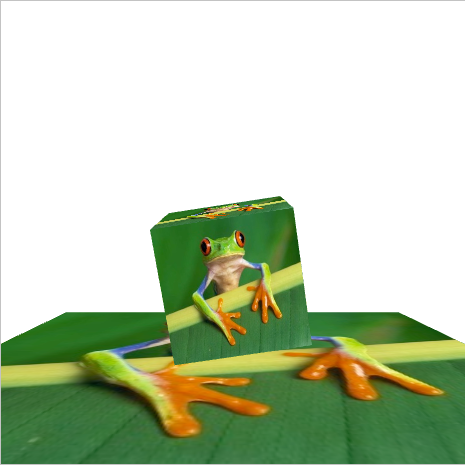
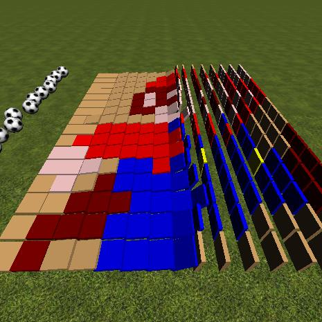
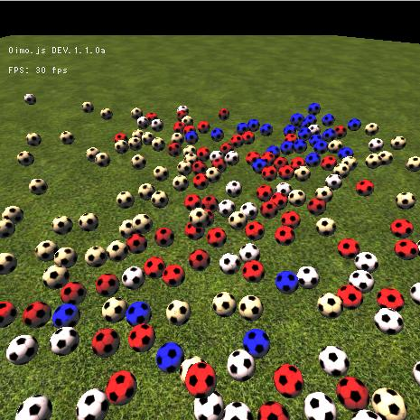
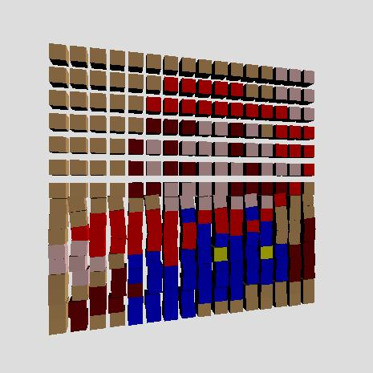
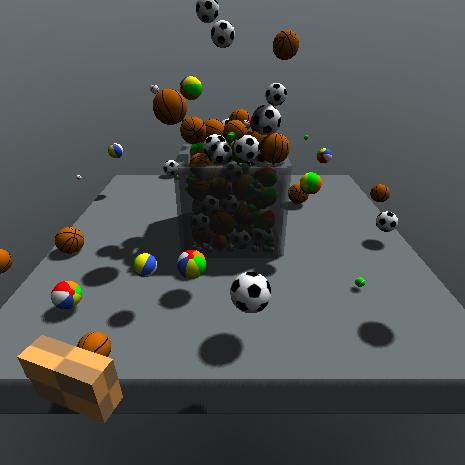
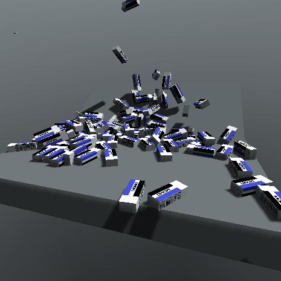

# webgl-physics-examples
Examples of WebGL Physics Library 

## Minimum examples

|Library                                                      |[ammo.js](https://github.com/kripken/ammo.js/)                                          |[Cannon.js](https://github.com/schteppe/cannon.js)                                        |[Oimo.js](https://github.com/lo-th/Oimo.js/)                                            |[OimoPhysics](https://github.com/saharan/OimoPhysics)                                         |
|:------------------------------------------------------------|:---------------------------------------------------------------------------------------|:-----------------------------------------------------------------------------------------|:---------------------------------------------------------------------------------------|:---------------------------------------------------------------------------------------------|
|WebGL 1.0                                                    |                                                                                        |                                                                                          |[Link](https://cx20.github.io/webgl-physics-examples/examples/webgl1/oimo/minimum/)     |                                                                                              |
|[Ashes](https://github.com/but0n/Ashes)                      |                                                                                        |                                                                                          |[Link](https://cx20.github.io/webgl-physics-examples/examples/ashes/oimo/minimum/)      |                                                                                              |
|[Babylon.js](https://github.com/BabylonJS/Babylon.js)        |[Link](https://cx20.github.io/webgl-physics-examples/examples/babylonjs/ammo/minimum/)  |[Link](https://cx20.github.io/webgl-physics-examples/examples/babylonjs/cannon/minimum/)  |[Link](https://cx20.github.io/webgl-physics-examples/examples/babylonjs/oimo/minimum/)  |                                                                                              |
|[ClayGL](https://github.com/pissang/claygl)                  |                                                                                        |                                                                                          |[Link](https://cx20.github.io/webgl-physics-examples/examples/claygl/oimo/minimum/)     |                                                                                              |
|[CZPG.js](https://github.com/PrincessGod/CraZyPG)            |                                                                                        |                                                                                          |[Link](https://cx20.github.io/webgl-physics-examples/examples/czpg/oimo/minimum/)       |                                                                                              |
|[GLBoost](https://github.com/emadurandal/GLBoost)            |                                                                                        |                                                                                          |[Link](https://cx20.github.io/webgl-physics-examples/examples/glboost/oimo/minimum/)    |                                                                                              |
|[Grimoire.js](https://github.com/GrimoireGL/GrimoireJS)      |                                                                                        |                                                                                          |[Link](https://cx20.github.io/webgl-physics-examples/examples/grimoirejs/oimo/minimum/) |[Link](https://cx20.github.io/webgl-physics-examples/examples/grimoirejs/oimophysics/minimum/)|
|[Hilo3d](https://github.com/hiloteam/Hilo3d)                 |                                                                                        |                                                                                          |[Link](https://cx20.github.io/webgl-physics-examples/examples/hilo3d/oimo/minimum/)     |                                                                                              |
|[PlayCanvas](https://github.com/playcanvas/engine)           |[Link](https://cx20.github.io/webgl-physics-examples/examples/playcanvas/ammo/minimum/) |                                                                                          |                                                                                        |                                                                                              |
|[three.js](https://github.com/mrdoob/three.js/)              |[Link](https://cx20.github.io/webgl-physics-examples/examples/threejs/ammo/minimum/)    |[Link](https://cx20.github.io/webgl-physics-examples/examples/threejs/cannon/minimum/)    |[Link](https://cx20.github.io/webgl-physics-examples/examples/threejs/oimo/minimum/)    |[Link](https://cx20.github.io/webgl-physics-examples/examples/threejs/oimophysics/minimum/)   |
|[XenoGL](https://github.com/kotofurumiya/xenogl)             |                                                                                        |                                                                                          |[Link](https://cx20.github.io/webgl-physics-examples/examples/xenogl/oimo/minimum/)     |[Link](https://cx20.github.io/webgl-physics-examples/examples/xenogl/oimophysics/minimum/)    |

## Domino examples

|Library                                                      |[ammo.js](https://github.com/kripken/ammo.js/)                                          |[Cannon.js](https://github.com/schteppe/cannon.js)                                        |[Oimo.js](https://github.com/lo-th/Oimo.js/)                                            |[OimoPhysics](https://github.com/saharan/OimoPhysics)                                         |
|:------------------------------------------------------------|:---------------------------------------------------------------------------------------|:-----------------------------------------------------------------------------------------|:---------------------------------------------------------------------------------------|:---------------------------------------------------------------------------------------------|
|WebGL 1.0                                                    |                                                                                        |                                                                                          |[Link](https://cx20.github.io/webgl-physics-examples/examples/webgl1/oimo/domino/)      |                                                                                              |
|[Babylon.js](https://github.com/BabylonJS/Babylon.js)        |[Link](https://cx20.github.io/webgl-physics-examples/examples/babylonjs/ammo/domino/)   |[Link](https://cx20.github.io/webgl-physics-examples/examples/babylonjs/cannon/domino/)   |[Link](https://cx20.github.io/webgl-physics-examples/examples/babylonjs/oimo/domino/)   |                                                                                              |
|[GLBoost](https://github.com/emadurandal/GLBoost)            |[Link](https://cx20.github.io/webgl-physics-examples/examples/glboost/ammo/domino/)     |[Link](https://cx20.github.io/webgl-physics-examples/examples/glboost/cannon/domino/)     |[Link](https://cx20.github.io/webgl-physics-examples/examples/glboost/oimo/domino/)     |                                                                                              |
|[Grimoire.js](https://github.com/GrimoireGL/GrimoireJS)      |                                                                                        |[Link](https://cx20.github.io/webgl-physics-examples/examples/grimoirejs/cannon/domino/)  |[Link](https://cx20.github.io/webgl-physics-examples/examples/grimoirejs/oimo/domino/)  |[Link](https://cx20.github.io/webgl-physics-examples/examples/grimoirejs/oimophysics/domino/) |
|[PlayCanvas](https://github.com/playcanvas/engine)           |[Link](https://cx20.github.io/webgl-physics-examples/examples/playcanvas/ammo/domino/)  |                                                                                          |                                                                                        |                                                                                              |
|[three.js](https://github.com/mrdoob/three.js/)              |[Link](https://cx20.github.io/webgl-physics-examples/examples/threejs/ammo/domino/)     |[Link](https://cx20.github.io/webgl-physics-examples/examples/threejs/cannon/domino/)     |[Link](https://cx20.github.io/webgl-physics-examples/examples/threejs/oimo/domino/)     |[Link](https://cx20.github.io/webgl-physics-examples/examples/threejs/oimophysics/domino/)    |

## Falling Football examples

|Library                                                      |[ammo.js](https://github.com/kripken/ammo.js/)                                          |[Cannon.js](https://github.com/schteppe/cannon.js)                                        |[Oimo.js](https://github.com/lo-th/Oimo.js/)                                            |[OimoPhysics](https://github.com/saharan/OimoPhysics)                                         |
|:------------------------------------------------------------|:---------------------------------------------------------------------------------------|:-----------------------------------------------------------------------------------------|:---------------------------------------------------------------------------------------|:---------------------------------------------------------------------------------------------|
|[Babylon.js](https://github.com/BabylonJS/Babylon.js)        |[Link](https://cx20.github.io/webgl-physics-examples/examples/babylonjs/ammo/football/) |[Link](https://cx20.github.io/webgl-physics-examples/examples/babylonjs/cannon/football/) |[Link](https://cx20.github.io/webgl-physics-examples/examples/babylonjs/oimo/football/) |                                                                                              |
|[GLBoost](https://github.com/emadurandal/GLBoost)            |                                                                                        |[Link](https://cx20.github.io/webgl-physics-examples/examples/glboost/cannon/football/)   |[Link](https://cx20.github.io/webgl-physics-examples/examples/glboost/oimo/football/)   |                                                                                              |
|[Grimoire.js](https://github.com/GrimoireGL/GrimoireJS)      |                                                                                        |[Link](https://cx20.github.io/webgl-physics-examples/examples/grimoirejs/cannon/football/)|[Link](https://cx20.github.io/webgl-physics-examples/examples/grimoirejs/oimo/football/)|[Link](https://cx20.github.io/webgl-physics-examples/examples/grimoirejs/oimophysics/domino/) |
|[PlayCanvas](https://github.com/playcanvas/engine)           |[Link](https://cx20.github.io/webgl-physics-examples/examples/playcanvas/ammo/football/)|                                                                                          |                                                                                        |                                                                                              |
|[three.js](https://github.com/mrdoob/three.js/)              |[Link](https://cx20.github.io/webgl-physics-examples/examples/threejs/ammo/football/)   |[Link](https://cx20.github.io/webgl-physics-examples/examples/threejs/cannon/football/)   |[Link](https://cx20.github.io/webgl-physics-examples/examples/threejs/oimo/football/)   |[Link](https://cx20.github.io/webgl-physics-examples/examples/threejs/oimophysics/football/)  |

## Stacked Boxes examples

|Library                                                      |[ammo.js](https://github.com/kripken/ammo.js/)                                          |[Cannon.js](https://github.com/schteppe/cannon.js)                                        |[Oimo.js](https://github.com/lo-th/Oimo.js/)                                            |[OimoPhysics](https://github.com/saharan/OimoPhysics)                                         |
|:------------------------------------------------------------|:---------------------------------------------------------------------------------------|:-----------------------------------------------------------------------------------------|:---------------------------------------------------------------------------------------|:---------------------------------------------------------------------------------------------|
|[Babylon.js](https://github.com/BabylonJS/Babylon.js)        |[Link](https://cx20.github.io/webgl-physics-examples/examples/babylonjs/ammo/box/)      |[Link](https://cx20.github.io/webgl-physics-examples/examples/babylonjs/cannon/box/)      |[Link](https://cx20.github.io/webgl-physics-examples/examples/babylonjs/oimo/box/)      |                                                                                              |
|[GLBoost](https://github.com/emadurandal/GLBoost)            |                                                                                        |[Link](https://cx20.github.io/webgl-physics-examples/examples/glboost/cannon/box/)        |[Link](https://cx20.github.io/webgl-physics-examples/examples/glboost/oimo/box/)        |                                                                                              |
|[Grimoire.js](https://github.com/GrimoireGL/GrimoireJS)      |                                                                                        |                                                                                          |[Link](https://cx20.github.io/webgl-physics-examples/examples/grimoirejs/oimo/box/)     |                                                                                              |
|[PlayCanvas](https://github.com/playcanvas/engine)           |[Link](https://cx20.github.io/webgl-physics-examples/examples/playcanvas/ammo/box/)     |                                                                                          |                                                                                        |                                                                                              |
|[three.js](https://github.com/mrdoob/three.js/)              |[Link](https://cx20.github.io/webgl-physics-examples/examples/threejs/ammo/box/)        |[Link](https://cx20.github.io/webgl-physics-examples/examples/threejs/cannon/box/)        |[Link](https://cx20.github.io/webgl-physics-examples/examples/threejs/oimo/box/)        |[Link](https://cx20.github.io/webgl-physics-examples/examples/threejs/oimophysics/box/)       |

## Falling Balls examples

|Library                                                      |[ammo.js](https://github.com/kripken/ammo.js/)                                          |[Cannon.js](https://github.com/schteppe/cannon.js)                                        |[Oimo.js](https://github.com/lo-th/Oimo.js/)                                            |[OimoPhysics](https://github.com/saharan/OimoPhysics)                                         |
|:------------------------------------------------------------|:---------------------------------------------------------------------------------------|:-----------------------------------------------------------------------------------------|:---------------------------------------------------------------------------------------|:---------------------------------------------------------------------------------------------|
|[Babylon.js](https://github.com/BabylonJS/Babylon.js)        |[Link](https://cx20.github.io/webgl-physics-examples/examples/babylonjs/ammo/balls/)    |[Link](https://cx20.github.io/webgl-physics-examples/examples/babylonjs/cannon/balls/)    |[Link](https://cx20.github.io/webgl-physics-examples/examples/babylonjs/oimo/balls/)    |                                                                                              |
|[GLBoost](https://github.com/emadurandal/GLBoost)            |                                                                                        |                                                                                          |[Link](https://cx20.github.io/webgl-physics-examples/examples/glboost/oimo/balls/)      |                                                                                              |
|[Grimoire.js](https://github.com/GrimoireGL/GrimoireJS)      |                                                                                        |                                                                                          |[Link](https://cx20.github.io/webgl-physics-examples/examples/grimoirejs/oimo/balls/)   |                                                                                              |
|[three.js](https://github.com/mrdoob/three.js/)              |                                                                                        |                                                                                          |[Link](https://cx20.github.io/webgl-physics-examples/examples/threejs/oimo/balls/)      |[Link](https://cx20.github.io/webgl-physics-examples/examples/threejs/oimophysics/balls/)     |

## Falling Eraser examples

|Library                                                      |[ammo.js](https://github.com/kripken/ammo.js/)                                          |[Cannon.js](https://github.com/schteppe/cannon.js)                                        |[Oimo.js](https://github.com/lo-th/Oimo.js/)                                            |[OimoPhysics](https://github.com/saharan/OimoPhysics)                                         |
|:------------------------------------------------------------|:---------------------------------------------------------------------------------------|:-----------------------------------------------------------------------------------------|:---------------------------------------------------------------------------------------|:---------------------------------------------------------------------------------------------|
|WebGL 1.0                                                    |                                                                                        |                                                                                          |[Link](https://cx20.github.io/webgl-physics-examples/examples/webgl1/oimo/eraser/)      |                                                                                              |
|[Babylon.js](https://github.com/BabylonJS/Babylon.js)        |                                                                                        |                                                                                          |[Link](https://cx20.github.io/webgl-physics-examples/examples/babylonjs/oimo/eraser/)   |                                                                                              |
|[GLBoost](https://github.com/emadurandal/GLBoost)            |                                                                                        |                                                                                          |[Link](https://cx20.github.io/webgl-physics-examples/examples/glboost/oimo/eraser/)     |                                                                                              |
|[Grimoire.js](https://github.com/GrimoireGL/GrimoireJS)      |                                                                                        |                                                                                          |[Link](https://cx20.github.io/webgl-physics-examples/examples/grimoirejs/oimo/eraser/)  |                                                                                              |
|[three.js](https://github.com/mrdoob/three.js/)              |                                                                                        |                                                                                          |[Link](https://cx20.github.io/webgl-physics-examples/examples/threejs/oimo/eraser/)     |                                                                                              |
