# webgl-physics-examples
Examples of WebGL Physics Library. 

## Minimum examples

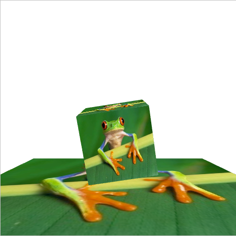

|Library                                                      |[ammo.js](https://github.com/kripken/ammo.js/)                                          |[Cannon.js](https://github.com/schteppe/cannon.js) /  [cannon-es](https://github.com/pmndrs/cannon-es)                                                                           |[Havok](https://doc.babylonjs.com/features/featuresDeepDive/physics)                      |[Oimo.js](https://github.com/lo-th/Oimo.js/) /   [OimoPhysics](https://github.com/saharan/OimoPhysics)                                                                                 |[PhysX](https://github.com/fabmax/physx-js-webidl)                                        |[rapier](https://github.com/dimforge/rapier)                                              |WGSL                                                                        |
|:------------------------------------------------------------|:---------------------------------------------------------------------------------------|:-----------------------------------------------------------------------------------------------------------------------------------------------------------------------------------|:-----------------------------------------------------------------------------------------|:-----------------------------------------------------------------------------------------------------------------------------------------------------------------------------------------|:-----------------------------------------------------------------------------------------|:-----------------------------------------------------------------------------------------|:------------------------------------------------------------------------------------------|
|WebGL 1.0                                                    |                                                                                        |                                                                                                                                                                                    |[Link](https://cx20.github.io/webgl-physics-examples/examples/webgl1/havok/minimum/)      |[Link](https://cx20.github.io/webgl-physics-examples/examples/webgl1/oimo/minimum/)                                                                                                       |                                                                                          |                                                                                          |                                                                                           |
|WebGL 2.0                                                    |                                                                                        |                                                                                                                                                                                    |[Link](https://cx20.github.io/webgl-physics-examples/examples/webgl2/havok/minimum/)      |[Link](https://cx20.github.io/webgl-physics-examples/examples/webgl2/oimo/minimum/)                                                                                                       |                                                                                          |                                                                                          |                                                                                           |
|WebGPU                                                       |                                                                                        |                                                                                                                                                                                    |[Link](https://cx20.github.io/webgl-physics-examples/examples/webgpu/havok/minimum/)       |[Link](https://cx20.github.io/webgl-physics-examples/examples/webgpu/oimo/minimum/)                                                                                                       |                                                                                          |                                                                                          |[Link](https://cx20.github.io/webgl-physics-examples/examples/webgpu/wgsl_compute/minimum/) (WIP)|
|[Ashes](https://github.com/but0n/Ashes)                      |                                                                                        |                                                                                                                                                                                    |                                                                                          |[Link](https://cx20.github.io/webgl-physics-examples/examples/ashes/oimo/minimum/)                                                                                                        |                                                                                          |                                                                                          |                                                                                           |
|[Babylon.js](https://github.com/BabylonJS/Babylon.js)        |[Link](https://cx20.github.io/webgl-physics-examples/examples/babylonjs/ammo/minimum/)  |[Link](https://cx20.github.io/webgl-physics-examples/examples/babylonjs/cannon/minimum/)                                                                                            |[Link](https://cx20.github.io/webgl-physics-examples/examples/babylonjs/havok/minimum/)   |[Link](https://cx20.github.io/webgl-physics-examples/examples/babylonjs/oimo/minimum/)                                                                                                    |                                                                                          |                                                                                          |[Link](https://cx20.github.io/webgl-physics-examples/examples/babylonjs/wgsl_compute/minimum/) (WIP)|
|[Babylon.js Lite](https://github.com/BabylonJS/Babylon.js)  |                                                                                        |                                                                                                                                                                                    |[Link](https://cx20.github.io/webgl-physics-examples/examples/babylonjs-lite/havok/minimum/)|                                                                                                                                                                                          |                                                                                          |                                                                                          |                                                                            |
|[ClayGL](https://github.com/pissang/claygl)                  |                                                                                        |                                                                                                                                                                                    |                                                                                          |[Link](https://cx20.github.io/webgl-physics-examples/examples/claygl/oimo/minimum/)                                                                                                       |                                                                                          |                                                                                          |                                                                                           |
|[CZPG.js](https://github.com/PrincessGod/CraZyPG)            |                                                                                        |                                                                                                                                                                                    |                                                                                          |[Link](https://cx20.github.io/webgl-physics-examples/examples/czpg/oimo/minimum/)                                                                                                         |                                                                                          |                                                                                          |                                                                                           |
|[Filament](https://github.com/google/filament)               |                                                                                        |                                                                                                                                                                                    |[Link](https://cx20.github.io/webgl-physics-examples/examples/filament/havok/minimum/)    |                                                                                                                                                                                          |                                                                                          |                                                                                          |                                                                                           |
|[GLBoost](https://github.com/emadurandal/GLBoost)            |                                                                                        |                                                                                                                                                                                    |                                                                                          |[Link](https://cx20.github.io/webgl-physics-examples/examples/glboost/oimo/minimum/)                                                                                                      |                                                                                          |                                                                                          |                                                                                           |
|[Grimoire.js](https://github.com/GrimoireGL/GrimoireJS)      |                                                                                        |                                                                                                                                                                                    |                                                                                          |[Link1](https://cx20.github.io/webgl-physics-examples/examples/grimoirejs/oimo/minimum/) / [Link2](https://cx20.github.io/webgl-physics-examples/examples/grimoirejs/oimophysics/minimum/)|                                                                                          |                                                                                          |                                                                                           |
|[Hilo3d](https://github.com/hiloteam/Hilo3d)                 |                                                                                        |                                                                                                                                                                                    |                                                                                          |[Link](https://cx20.github.io/webgl-physics-examples/examples/hilo3d/oimo/minimum/)                                                                                                       |                                                                                          |                                                                                          |                                                                                           |
|[PlayCanvas](https://github.com/playcanvas/engine)           |[Link](https://cx20.github.io/webgl-physics-examples/examples/playcanvas/ammo/minimum/) |                                                                                                                                                                                    |[Link](https://cx20.github.io/webgl-physics-examples/examples/playcanvas/havok/minimum/)  |                                                                                                                                                                                          |                                                                                          |                                                                                          |                                                                                           |
|[Rhodonite](https://github.com/actnwit/RhodoniteTS)          |                                                                                        |                                                                                                                                                                                    |[Link](https://cx20.github.io/webgl-physics-examples/examples/rhodonite/havok/minimum/)  |[Link](https://cx20.github.io/webgl-physics-examples/examples/rhodonite/oimo/minimum/)                                                                                                    |                                                                                          |                                                                                          |                                                                                           |
|[three.js](https://github.com/mrdoob/three.js/)              |[Link1](https://cx20.github.io/webgl-physics-examples/examples/threejs/ammo/minimum/) / [Link2](https://cx20.github.io/webgl-physics-examples/examples/threejs/ammo_legacy/minimum/) (WIP)|[Link1](https://cx20.github.io/webgl-physics-examples/examples/threejs/cannon/minimum/) / [Link2](https://cx20.github.io/webgl-physics-examples/examples/threejs/cannon-es/minimum/)|[Link](https://cx20.github.io/webgl-physics-examples/examples/threejs/havok/minimum/)    |[Link1](https://cx20.github.io/webgl-physics-examples/examples/threejs/oimo/minimum/) / [Link2](https://cx20.github.io/webgl-physics-examples/examples/threejs/oimophysics/minimum/)      |[Link](https://cx20.github.io/webgl-physics-examples/examples/threejs/physx/minimum/)     |[Link](https://cx20.github.io/webgl-physics-examples/examples/threejs/rapier/minimum/)    |[Link](https://cx20.github.io/webgl-physics-examples/examples/threejs/wgsl_compute/minimum/) (WIP)|
|[XenoGL](https://github.com/kotofurumiya/xenogl)             |                                                                                        |                                                                                                                                                                                    |                                                                                          |[Link1](https://cx20.github.io/webgl-physics-examples/examples/xenogl/oimo/minimum/) / [Link2](https://cx20.github.io/webgl-physics-examples/examples/xenogl/oimophysics/minimum/)        |                                                                                          |                                                                                          |                                                                                           |

## Domino examples

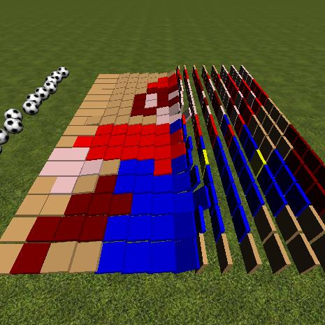

|Library                                                      |[ammo.js](https://github.com/kripken/ammo.js/)                                          |[Cannon.js](https://github.com/schteppe/cannon.js) /  [cannon-es](https://github.com/pmndrs/cannon-es)                                                                           |[Havok](https://doc.babylonjs.com/features/featuresDeepDive/physics)                         |[Oimo.js](https://github.com/lo-th/Oimo.js/) /   [OimoPhysics](https://github.com/saharan/OimoPhysics)                                                                                |[PhysX](https://github.com/fabmax/physx-js-webidl)                                        |[rapier](https://github.com/dimforge/rapier)                                              |WGSL                                                                         |
|:------------------------------------------------------------|:---------------------------------------------------------------------------------------|:-----------------------------------------------------------------------------------------------------------------------------------------------------------------------------------|:--------------------------------------------------------------------------------------------|:----------------------------------------------------------------------------------------------------------------------------------------------------------------------------------------|:-----------------------------------------------------------------------------------------|:-----------------------------------------------------------------------------------------|:----------------------------------------------------------------------------|
|WebGL 1.0                                                    |                                                                                        |                                                                                                                                                                                    |[Link](https://cx20.github.io/webgl-physics-examples/examples/webgl1/havok/domino/)         |[Link](https://cx20.github.io/webgl-physics-examples/examples/webgl1/oimo/domino/)                                                                                                       |                                                                                          |                                                                                          |                                                                             |
|WebGL 2.0                                                    |                                                                                        |                                                                                                                                                                                    |[Link](https://cx20.github.io/webgl-physics-examples/examples/webgl2/havok/domino/)         |[Link](https://cx20.github.io/webgl-physics-examples/examples/webgl2/oimo/domino/)                                                                                                       |                                                                                          |                                                                                          |                                                                             |
|WebGPU                                                       |                                                                                        |                                                                                                                                                                                    |[Link](https://cx20.github.io/webgl-physics-examples/examples/webgpu/havok/domino/)         |[Link](https://cx20.github.io/webgl-physics-examples/examples/webgpu/oimo/domino/)                                                                                                       |                                                                                          |                                                                                          |[Link](https://cx20.github.io/webgl-physics-examples/examples/webgpu/wgsl_compute/domino/) (WIP)|
|[Babylon.js](https://github.com/BabylonJS/Babylon.js)        |[Link](https://cx20.github.io/webgl-physics-examples/examples/babylonjs/ammo/domino/)   |[Link](https://cx20.github.io/webgl-physics-examples/examples/babylonjs/cannon/domino/)                                                                                             |[Link](https://cx20.github.io/webgl-physics-examples/examples/babylonjs/havok/domino/)       |[Link](https://cx20.github.io/webgl-physics-examples/examples/babylonjs/oimo/domino/)                                                                                                    |                                                                                          |                                                                                          |[Link](https://cx20.github.io/webgl-physics-examples/examples/babylonjs/wgsl_compute/domino/) (WIP)|
|[Babylon.js Lite](https://github.com/BabylonJS/Babylon.js)  |                                                                                        |                                                                                                                                                                                    |[Link](https://cx20.github.io/webgl-physics-examples/examples/babylonjs-lite/havok/domino/)  |                                                                                                                                                                                          |                                                                                          |                                                                                          |                                                                             |
|[Filament](https://github.com/google/filament)               |                                                                                        |                                                                                                                                                                                    |[Link](https://cx20.github.io/webgl-physics-examples/examples/filament/havok/domino/)        |                                                                                                                                                                                         |                                                                                          |                                                                                          |                                                                             |
|[ClayGL](https://github.com/pissang/claygl)                  |                                                                                        |                                                                                                                                                                                    |                                                                                             |[Link](https://cx20.github.io/webgl-physics-examples/examples/claygl/oimo/domino/)                                                                                                       |                                                                                          |                                                                                          |                                                                             |
|[GLBoost](https://github.com/emadurandal/GLBoost)            |[Link](https://cx20.github.io/webgl-physics-examples/examples/glboost/ammo/domino/)     |[Link](https://cx20.github.io/webgl-physics-examples/examples/glboost/cannon/domino/)                                                                                               |                                                                                             |[Link](https://cx20.github.io/webgl-physics-examples/examples/glboost/oimo/domino/)                                                                                                      |                                                                                          |                                                                                          |                                                                             |
|[Grimoire.js](https://github.com/GrimoireGL/GrimoireJS)      |[Link](https://cx20.github.io/webgl-physics-examples/examples/grimoirejs/ammo/domino/)  |[Link](https://cx20.github.io/webgl-physics-examples/examples/grimoirejs/cannon/domino/)                                                                                            |                                                                                             |[Link1](https://cx20.github.io/webgl-physics-examples/examples/grimoirejs/oimo/domino/) / [Link2](https://cx20.github.io/webgl-physics-examples/examples/grimoirejs/oimophysics/domino/) |                                                                                          |                                                                                          |                                                                             |
|[Hilo3d](https://github.com/hiloteam/Hilo3d)                 |                                                                                        |                                                                                                                                                                                    |                                                                                             |[Link](https://cx20.github.io/webgl-physics-examples/examples/hilo3d/oimo/domino/)                                                                                                       |                                                                                          |                                                                                          |                                                                             |
|[PlayCanvas](https://github.com/playcanvas/engine)           |[Link](https://cx20.github.io/webgl-physics-examples/examples/playcanvas/ammo/domino/)  |                                                                                                                                                                                    |[Link](https://cx20.github.io/webgl-physics-examples/examples/playcanvas/havok/domino/)      |                                                                                                                                                                                         |                                                                                          |                                                                                          |                                                                             |
|[Rhodonite](https://github.com/actnwit/RhodoniteTS)          |                                                                                        |                                                                                                                                                                                    |[Link](https://cx20.github.io/webgl-physics-examples/examples/rhodonite/havok/domino/)      |[Link](https://cx20.github.io/webgl-physics-examples/examples/rhodonite/oimo/domino/)                                                                                                    |                                                                                          |                                                                                          |                                                                             |
|[three.js](https://github.com/mrdoob/three.js/)              |[Link1](https://cx20.github.io/webgl-physics-examples/examples/threejs/ammo/domino/) / [Link2](https://cx20.github.io/webgl-physics-examples/examples/threejs/ammo_legacy/domino/) (WIP)|[Link1](https://cx20.github.io/webgl-physics-examples/examples/threejs/cannon/domino/) / [Link2](https://cx20.github.io/webgl-physics-examples/examples/threejs/cannon-es/domino/)  |[Link](https://cx20.github.io/webgl-physics-examples/examples/threejs/havok/domino/)     |[Link1](https://cx20.github.io/webgl-physics-examples/examples/threejs/oimo/domino/) / [Link2](https://cx20.github.io/webgl-physics-examples/examples/threejs/oimophysics/domino/)        |[Link](https://cx20.github.io/webgl-physics-examples/examples/threejs/physx/domino/)      |[Link](https://cx20.github.io/webgl-physics-examples/examples/threejs/rapier/domino/)     |[Link](https://cx20.github.io/webgl-physics-examples/examples/threejs/wgsl_compute/domino/) (WIP)|

## Falling Football examples

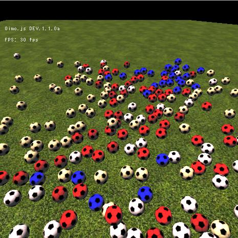

|Library                                                      |[ammo.js](https://github.com/kripken/ammo.js/)                                          |[Cannon.js](https://github.com/schteppe/cannon.js) /  [cannon-es](https://github.com/pmndrs/cannon-es)                                                                           |[Havok](https://doc.babylonjs.com/features/featuresDeepDive/physics)                           |[Oimo.js](https://github.com/lo-th/Oimo.js/) /   [OimoPhysics](https://github.com/saharan/OimoPhysics)                                                                              |[PhysX](https://github.com/fabmax/physx-js-webidl)                                            |[rapier](https://github.com/dimforge/rapier)                                                  |WGSL                                                                            |
|:------------------------------------------------------------|:---------------------------------------------------------------------------------------|:-----------------------------------------------------------------------------------------------------------------------------------------------------------------------------------|:----------------------------------------------------------------------------------------------|:--------------------------------------------------------------------------------------------------------------------------------------------------------------------------------------|:---------------------------------------------------------------------------------------------|:---------------------------------------------------------------------------------------------|:-------------------------------------------------------------------------------|
|WebGL 1.0                                                    |                                                                                        |                                                                                                                                                                                    |[Link](https://cx20.github.io/webgl-physics-examples/examples/webgl1/havok/football/)         |[Link](https://cx20.github.io/webgl-physics-examples/examples/webgl1/oimo/football/)                                                                                                   |                                                                                              |                                                                                              |                                                                                |
|WebGL 2.0                                                    |                                                                                        |                                                                                                                                                                                    |[Link](https://cx20.github.io/webgl-physics-examples/examples/webgl2/havok/football/)         |[Link](https://cx20.github.io/webgl-physics-examples/examples/webgl2/oimo/football/)                                                                                                   |                                                                                              |                                                                                              |                                                                                |
|WebGPU                                                       |                                                                                        |                                                                                                                                                                                    |[Link](https://cx20.github.io/webgl-physics-examples/examples/webgpu/havok/football/)         |[Link](https://cx20.github.io/webgl-physics-examples/examples/webgpu/oimo/football/)                                                                                                   |                                                                                              |                                                                                              |[Link](https://cx20.github.io/webgl-physics-examples/examples/webgpu/wgsl_compute/football/) (WIP)|
|[Babylon.js](https://github.com/BabylonJS/Babylon.js)        |[Link](https://cx20.github.io/webgl-physics-examples/examples/babylonjs/ammo/football/) |[Link](https://cx20.github.io/webgl-physics-examples/examples/babylonjs/cannon/football/)                                                                                           |[Link](https://cx20.github.io/webgl-physics-examples/examples/babylonjs/havok/football/)       |[Link](https://cx20.github.io/webgl-physics-examples/examples/babylonjs/oimo/football/)                                                                                                |                                                                                              |                                                                                              |[Link](https://cx20.github.io/webgl-physics-examples/examples/babylonjs/wgsl_compute/football/) (WIP)|
|[Babylon.js Lite](https://github.com/BabylonJS/Babylon.js)  |                                                                                        |                                                                                                                                                                                    |[Link](https://cx20.github.io/webgl-physics-examples/examples/babylonjs-lite/havok/football/)  |                                                                                                                                                                                       |                                                                                              |                                                                                              |                                                                            |
|[Filament](https://github.com/google/filament)               |                                                                                        |                                                                                                                                                                                    |[Link](https://cx20.github.io/webgl-physics-examples/examples/filament/havok/football/)        |                                                                                                                                                                                       |                                                                                              |                                                                                              |                                                                                |
|[ClayGL](https://github.com/pissang/claygl)                  |                                                                                        |                                                                                                                                                                                    |                                                                                               |[Link](https://cx20.github.io/webgl-physics-examples/examples/claygl/oimo/football/)                                                                                                   |                                                                                              |                                                                                              |                                                                                |
|[GLBoost](https://github.com/emadurandal/GLBoost)            |[Link](https://cx20.github.io/webgl-physics-examples/examples/glboost/ammo/football/)   |[Link](https://cx20.github.io/webgl-physics-examples/examples/glboost/cannon/football/)                                                                                             |                                                                                               |[Link](https://cx20.github.io/webgl-physics-examples/examples/glboost/oimo/football/)                                                                                                  |                                                                                              |                                                                                              |                                                                                |
|[Grimoire.js](https://github.com/GrimoireGL/GrimoireJS)      |[Link](https://cx20.github.io/webgl-physics-examples/examples/grimoirejs/ammo/football/)|[Link](https://cx20.github.io/webgl-physics-examples/examples/grimoirejs/cannon/football/)                                                                                          |                                                                                               |[Link](https://cx20.github.io/webgl-physics-examples/examples/grimoirejs/oimo/football/)                                                                                               |                                                                                              |                                                                                              |                                                                                |
|[PlayCanvas](https://github.com/playcanvas/engine)           |[Link](https://cx20.github.io/webgl-physics-examples/examples/playcanvas/ammo/football/)|                                                                                                                                                                                    |[Link](https://cx20.github.io/webgl-physics-examples/examples/playcanvas/havok/football/)      |                                                                                                                                                                                       |                                                                                              |                                                                                              |                                                                                |
|[Rhodonite](https://github.com/actnwit/RhodoniteTS)          |                                                                                        |                                                                                                                                                                                    |[Link](https://cx20.github.io/webgl-physics-examples/examples/rhodonite/havok/football/)      |[Link](https://cx20.github.io/webgl-physics-examples/examples/rhodonite/oimo/football/)                                                                                                |                                                                                              |                                                                                              |                                                                                |
|[three.js](https://github.com/mrdoob/three.js/)              |[Link1](https://cx20.github.io/webgl-physics-examples/examples/threejs/ammo/football/) / [Link2](https://cx20.github.io/webgl-physics-examples/examples/threejs/ammo_legacy/football/) (WIP)|[Link1](https://cx20.github.io/webgl-physics-examples/examples/threejs/cannon/football/) / [Link2](https://cx20.github.io/webgl-physics-examples/examples/threejs/cannon-es/football/)|[Link](https://cx20.github.io/webgl-physics-examples/examples/threejs/havok/football/)   |[Link1](https://cx20.github.io/webgl-physics-examples/examples/threejs/oimo/football/) / [Link2](https://cx20.github.io/webgl-physics-examples/examples/threejs/oimophysics/football/)   |[Link](https://cx20.github.io/webgl-physics-examples/examples/threejs/physx/football/)        |[Link](https://cx20.github.io/webgl-physics-examples/examples/threejs/rapier/football/)       |[Link](https://cx20.github.io/webgl-physics-examples/examples/threejs/wgsl_compute/football/) (WIP)|

## Stacked Boxes examples

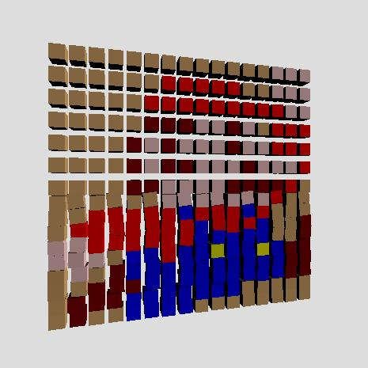

|Library                                                      |[ammo.js](https://github.com/kripken/ammo.js/)                                          |[Cannon.js](https://github.com/schteppe/cannon.js) /  [cannon-es](https://github.com/pmndrs/cannon-es)                                                                           |[Havok](https://doc.babylonjs.com/features/featuresDeepDive/physics)                      |[Oimo.js](https://github.com/lo-th/Oimo.js/) /   [OimoPhysics](https://github.com/saharan/OimoPhysics)                                                                             |[PhysX](https://github.com/fabmax/physx-js-webidl)                                            |[rapier](https://github.com/dimforge/rapier)                                                  |WGSL                                                                        |
|:------------------------------------------------------------|:---------------------------------------------------------------------------------------|:-----------------------------------------------------------------------------------------------------------------------------------------------------------------------------------|:-----------------------------------------------------------------------------------------|:-------------------------------------------------------------------------------------------------------------------------------------------------------------------------------------|:---------------------------------------------------------------------------------------------|:---------------------------------------------------------------------------------------------|:---------------------------------------------------------------------------|
|WebGL 1.0                                                    |                                                                                        |                                                                                                                                                                                    |[Link](https://cx20.github.io/webgl-physics-examples/examples/webgl1/havok/box/)         |[Link](https://cx20.github.io/webgl-physics-examples/examples/webgl1/oimo/box/)                                                                                                       |                                                                                              |                                                                                              |                                                                            |
|WebGL 2.0                                                    |                                                                                        |                                                                                                                                                                                    |[Link](https://cx20.github.io/webgl-physics-examples/examples/webgl2/havok/box/)         |[Link](https://cx20.github.io/webgl-physics-examples/examples/webgl2/oimo/box/)                                                                                                       |                                                                                              |                                                                                              |                                                                            |
|WebGPU                                                       |                                                                                        |                                                                                                                                                                                    |[Link](https://cx20.github.io/webgl-physics-examples/examples/webgpu/havok/box/)         |[Link](https://cx20.github.io/webgl-physics-examples/examples/webgpu/oimo/box/)                                                                                                       |                                                                                              |                                                                                              |[Link](https://cx20.github.io/webgl-physics-examples/examples/webgpu/wgsl_compute/box/) (WIP)|
|[Babylon.js](https://github.com/BabylonJS/Babylon.js)        |[Link](https://cx20.github.io/webgl-physics-examples/examples/babylonjs/ammo/box/)      |[Link](https://cx20.github.io/webgl-physics-examples/examples/babylonjs/cannon/box/)                                                                                                |[Link](https://cx20.github.io/webgl-physics-examples/examples/babylonjs/havok/box/)       |[Link](https://cx20.github.io/webgl-physics-examples/examples/babylonjs/oimo/box/)                                                                                                    |                                                                                              |                                                                                              |[Link](https://cx20.github.io/webgl-physics-examples/examples/babylonjs/wgsl_compute/box/) (WIP)|
|[Babylon.js Lite](https://github.com/BabylonJS/Babylon.js)  |                                                                                        |                                                                                                                                                                                    |[Link](https://cx20.github.io/webgl-physics-examples/examples/babylonjs-lite/havok/box/) |                                                                                                                                                                                       |                                                                                              |                                                                                              |                                                                            |
|[Filament](https://github.com/google/filament)               |                                                                                        |                                                                                                                                                                                    |[Link](https://cx20.github.io/webgl-physics-examples/examples/filament/havok/box/)        |                                                                                                                                                                                      |                                                                                              |                                                                                              |                                                                            |
|[ClayGL](https://github.com/pissang/claygl)                  |                                                                                        |                                                                                                                                                                                    |                                                                                          |[Link](https://cx20.github.io/webgl-physics-examples/examples/claygl/oimo/box/)                                                                                                       |                                                                                              |                                                                                              |                                                                            |
|[GLBoost](https://github.com/emadurandal/GLBoost)            |                                                                                        |[Link](https://cx20.github.io/webgl-physics-examples/examples/glboost/cannon/box/)                                                                                                  |                                                                                          |[Link](https://cx20.github.io/webgl-physics-examples/examples/glboost/oimo/box/)                                                                                                      |                                                                                              |                                                                                              |                                                                            |
|[Grimoire.js](https://github.com/GrimoireGL/GrimoireJS)      |                                                                                        |[Link](https://cx20.github.io/webgl-physics-examples/examples/grimoirejs/cannon/box/)                                                                                               |                                                                                          |[Link](https://cx20.github.io/webgl-physics-examples/examples/grimoirejs/oimo/box/)                                                                                                   |                                                                                              |                                                                                              |                                                                            |
|[PlayCanvas](https://github.com/playcanvas/engine)           |[Link](https://cx20.github.io/webgl-physics-examples/examples/playcanvas/ammo/box/)     |                                                                                                                                                                                    |[Link](https://cx20.github.io/webgl-physics-examples/examples/playcanvas/havok/box/)      |                                                                                                                                                                                      |                                                                                              |                                                                                              |                                                                            |
|[Rhodonite](https://github.com/actnwit/RhodoniteTS)          |                                                                                        |                                                                                                                                                                                    |[Link](https://cx20.github.io/webgl-physics-examples/examples/rhodonite/havok/box/)      |[Link](https://cx20.github.io/webgl-physics-examples/examples/rhodonite/oimo/box/)                                                                                                    |                                                                                              |                                                                                              |                                                                            |
|[three.js](https://github.com/mrdoob/three.js/)              |[Link1](https://cx20.github.io/webgl-physics-examples/examples/threejs/ammo/box/) / [Link2](https://cx20.github.io/webgl-physics-examples/examples/threejs/ammo_legacy/box/) (WIP)|[Link1](https://cx20.github.io/webgl-physics-examples/examples/threejs/cannon/box/) / [Link2](https://cx20.github.io/webgl-physics-examples/examples/threejs/cannon-es/box/)        |[Link](https://cx20.github.io/webgl-physics-examples/examples/threejs/havok/box/)        |[Link1](https://cx20.github.io/webgl-physics-examples/examples/threejs/oimo/box/) / [Link2](https://cx20.github.io/webgl-physics-examples/examples/threejs/oimophysics/box/)          |[Link](https://cx20.github.io/webgl-physics-examples/examples/threejs/physx/box/)             |[Link](https://cx20.github.io/webgl-physics-examples/examples/threejs/rapier/box/)            |[Link](https://cx20.github.io/webgl-physics-examples/examples/threejs/wgsl_compute/box/) (WIP)|

## Falling Balls examples

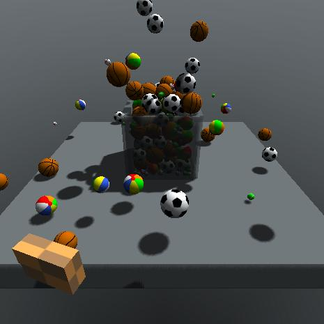

The WGSL versions run the physics in a compute shader using brute-force O(N²) collision.

|Library                                                      |[ammo.js](https://github.com/kripken/ammo.js/)                                          |[Cannon.js](https://github.com/schteppe/cannon.js) /   [cannon-es](https://github.com/pmndrs/cannon-es)                                                                          |[Havok](https://doc.babylonjs.com/features/featuresDeepDive/physics)                        |[Oimo.js](https://github.com/lo-th/Oimo.js/) /                                        [OimoPhysics](https://github.com/saharan/OimoPhysics)                                        |[rapier](https://github.com/dimforge/rapier)                                                  |WGSL                                                                        |
|:------------------------------------------------------------|:---------------------------------------------------------------------------------------|:-----------------------------------------------------------------------------------------------------------------------------------------------------------------------------------|:-------------------------------------------------------------------------------------------|:-------------------------------------------------------------------------------------------------------------------------------------------------------------------------------------|:---------------------------------------------------------------------------------------------|:---------------------------------------------------------------------------|
|WebGL 1.0                                                    |                                                                                        |                                                                                                                                                                                    |[Link](https://cx20.github.io/webgl-physics-examples/examples/webgl1/havok/balls/)        |[Link](https://cx20.github.io/webgl-physics-examples/examples/webgl1/oimo/balls/)                                                                                                     |                                                                                              |                                                                            |
|WebGL 2.0                                                    |                                                                                        |                                                                                                                                                                                    |[Link](https://cx20.github.io/webgl-physics-examples/examples/webgl2/havok/balls/)        |[Link](https://cx20.github.io/webgl-physics-examples/examples/webgl2/oimo/balls/)                                                                                                     |                                                                                              |                                                                            |
|WebGPU                                                       |                                                                                        |                                                                                                                                                                                    |[Link](https://cx20.github.io/webgl-physics-examples/examples/webgpu/havok/balls/)        |[Link](https://cx20.github.io/webgl-physics-examples/examples/webgpu/oimo/balls/)                                                                                                     |                                                                                              |[Link](https://cx20.github.io/webgl-physics-examples/examples/webgpu/wgsl_compute/balls/) (WIP)|
|[Babylon.js](https://github.com/BabylonJS/Babylon.js)        |[Link](https://cx20.github.io/webgl-physics-examples/examples/babylonjs/ammo/balls/)    |[Link](https://cx20.github.io/webgl-physics-examples/examples/babylonjs/cannon/balls/)                                                                                              |[Link](https://cx20.github.io/webgl-physics-examples/examples/babylonjs/havok/balls/)       |[Link](https://cx20.github.io/webgl-physics-examples/examples/babylonjs/oimo/balls/)                                                                                                  |                                                                                              |[Link](https://cx20.github.io/webgl-physics-examples/examples/babylonjs/wgsl_compute/balls/) (WIP)|
|[Babylon.js Lite](https://github.com/BabylonJS/Babylon.js)  |                                                                                        |                                                                                                                                                                                    |[Link](https://cx20.github.io/webgl-physics-examples/examples/babylonjs-lite/havok/balls/)  |                                                                                                                                                                                      |                                                                                              |                                                                            |
|[Filament](https://github.com/google/filament)               |                                                                                        |                                                                                                                                                                                    |[Link](https://cx20.github.io/webgl-physics-examples/examples/filament/havok/balls/)        |                                                                                                                                                                                      |                                                                                              |                                                                            |
|[ClayGL](https://github.com/pissang/claygl)                  |                                                                                        |                                                                                                                                                                                    |                                                                                            |[Link](https://cx20.github.io/webgl-physics-examples/examples/claygl/oimo/balls/)                                                                                                     |                                                                                              |                                                                            |
|[GLBoost](https://github.com/emadurandal/GLBoost)            |                                                                                        |                                                                                                                                                                                    |                                                                                            |[Link](https://cx20.github.io/webgl-physics-examples/examples/glboost/oimo/balls/)                                                                                                    |                                                                                              |                                                                            |
|[Grimoire.js](https://github.com/GrimoireGL/GrimoireJS)      |                                                                                        |                                                                                                                                                                                    |                                                                                            |[Link](https://cx20.github.io/webgl-physics-examples/examples/grimoirejs/oimo/balls/) (WIP)                                                                                                 |                                                                                              |                                                                            |
|[PlayCanvas](https://github.com/playcanvas/engine)           |[Link](https://cx20.github.io/webgl-physics-examples/examples/playcanvas/ammo/balls/)   |                                                                                                                                                                                    |[Link](https://cx20.github.io/webgl-physics-examples/examples/playcanvas/havok/balls/)      |                                                                                                                                                                                      |                                                                                              |                                                                            |
|[Rhodonite](https://github.com/actnwit/RhodoniteTS)          |                                                                                        |                                                                                                                                                                                    |[Link](https://cx20.github.io/webgl-physics-examples/examples/rhodonite/havok/balls/)      |[Link](https://cx20.github.io/webgl-physics-examples/examples/rhodonite/oimo/balls/)                                                                                                  |                                                                                              |                                                                            |
|[three.js](https://github.com/mrdoob/three.js/)              |                                                                                        | - /   [Link](https://cx20.github.io/webgl-physics-examples/examples/threejs/cannon-es/balls/)                                                                                   |[Link](https://cx20.github.io/webgl-physics-examples/examples/threejs/havok/balls/)      |[Link1](https://cx20.github.io/webgl-physics-examples/examples/threejs/oimo/balls/) / [Link2](https://cx20.github.io/webgl-physics-examples/examples/threejs/oimophysics/balls/)      |[Link](https://cx20.github.io/webgl-physics-examples/examples/threejs/rapier/balls/)          |[Link](https://cx20.github.io/webgl-physics-examples/examples/threejs/wgsl_compute/balls/) (WIP)|

## Falling glTF examples

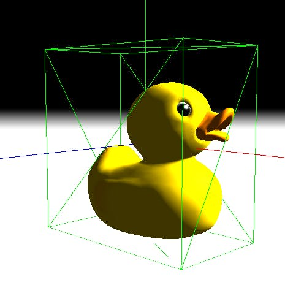

|Library                                                      |[ammo.js](https://github.com/kripken/ammo.js/)                                          |[Cannon.js](https://github.com/schteppe/cannon.js) /   [cannon-es](https://github.com/pmndrs/cannon-es)                                                                          |[Havok](https://doc.babylonjs.com/features/featuresDeepDive/physics)                        |[Oimo.js](https://github.com/lo-th/Oimo.js/) /   [OimoPhysics](https://github.com/saharan/OimoPhysics)                                                                              |[rapier](https://github.com/dimforge/rapier)                                              |WGSL                                                                            |
|:------------------------------------------------------------|:---------------------------------------------------------------------------------------|:-----------------------------------------------------------------------------------------------------------------------------------------------------------------------------------|:-------------------------------------------------------------------------------------------|:--------------------------------------------------------------------------------------------------------------------------------------------------------------------------------------|:-----------------------------------------------------------------------------------------|:-------------------------------------------------------------------------------|
|WebGL 1.0                                                    |                                                                                        |                                                                                                                                                                                    |[Link](https://cx20.github.io/webgl-physics-examples/examples/webgl1/havok/gltf/)         |[Link](https://cx20.github.io/webgl-physics-examples/examples/webgl1/oimo/gltf/)                                                                                                      |                                                                                          |                                                                                |
|WebGL 2.0                                                    |                                                                                        |                                                                                                                                                                                    |[Link](https://cx20.github.io/webgl-physics-examples/examples/webgl2/havok/gltf/)         |[Link](https://cx20.github.io/webgl-physics-examples/examples/webgl2/oimo/gltf/)                                                                                                      |                                                                                          |                                                                                |
|WebGPU                                                       |                                                                                        |                                                                                                                                                                                    |[Link](https://cx20.github.io/webgl-physics-examples/examples/webgpu/havok/gltf/)         |[Link](https://cx20.github.io/webgl-physics-examples/examples/webgpu/oimo/gltf/)                                                                                                      |                                                                                          |[Link](https://cx20.github.io/webgl-physics-examples/examples/webgpu/wgsl_compute/gltf/) (WIP)|
|[Babylon.js](https://github.com/BabylonJS/Babylon.js)        |[Link](https://cx20.github.io/webgl-physics-examples/examples/babylonjs/ammo/gltf/)     |[Link](https://cx20.github.io/webgl-physics-examples/examples/babylonjs/cannon/gltf/)                                                                                               |[Link](https://cx20.github.io/webgl-physics-examples/examples/babylonjs/havok/gltf/)        |[Link](https://cx20.github.io/webgl-physics-examples/examples/babylonjs/oimo/gltf/)                                                                                                    |                                                                                          |[Link](https://cx20.github.io/webgl-physics-examples/examples/babylonjs/wgsl_compute/gltf/) (WIP)|
|[Babylon.js Lite](https://github.com/BabylonJS/Babylon.js)  |                                                                                        |                                                                                                                                                                                    |[Link](https://cx20.github.io/webgl-physics-examples/examples/babylonjs-lite/havok/gltf/)   |                                                                                                                                                                                       |                                                                                          |                                                                                |
|[Filament](https://github.com/google/filament)               |                                                                                        |                                                                                                                                                                                    |[Link](https://cx20.github.io/webgl-physics-examples/examples/filament/havok/gltf/)         |                                                                                                                                                                                       |                                                                                          |                                                                                |
|[PlayCanvas](https://github.com/playcanvas/engine)           |[Link](https://cx20.github.io/webgl-physics-examples/examples/playcanvas/ammo/gltf/)    |                                                                                                                                                                                    |[Link](https://cx20.github.io/webgl-physics-examples/examples/playcanvas/havok/gltf/)       |                                                                                                                                                                                       |                                                                                          |                                                                                |
|[Rhodonite](https://github.com/actnwit/RhodoniteTS)          |                                                                                        |                                                                                                                                                                                    |[Link](https://cx20.github.io/webgl-physics-examples/examples/rhodonite/havok/gltf/)      |                                                                                                                                                                                       |                                                                                          |                                                                                |
|[three.js](https://github.com/mrdoob/three.js/)              |                                                                                        |                                                                                                                                                                                    |[Link](https://cx20.github.io/webgl-physics-examples/examples/threejs/havok/gltf/)        |[Link1](https://cx20.github.io/webgl-physics-examples/examples/threejs/oimo/gltf/) / [Link2](https://cx20.github.io/webgl-physics-examples/examples/threejs/oimophysics/gltf/)         |[Link](https://cx20.github.io/webgl-physics-examples/examples/threejs/rapier/gltf/)       |[Link](https://cx20.github.io/webgl-physics-examples/examples/threejs/wgsl_compute/gltf/) (WIP)|

## Falling Marbles examples (Using glTF)

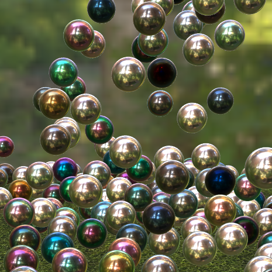

The WGSL versions run the physics in a compute shader using a uniform spatial-grid broad-phase (≈O(N)), so they scale to far more bodies.

|Library                                                      |[ammo.js](https://github.com/kripken/ammo.js/)                                          |[Cannon.js](https://github.com/schteppe/cannon.js) /   [cannon-es](https://github.com/pmndrs/cannon-es)                                                                          |[Havok](https://doc.babylonjs.com/features/featuresDeepDive/physics)                          |[Oimo.js](https://github.com/lo-th/Oimo.js/)  /   [OimoPhysics](https://github.com/saharan/OimoPhysics)                                                                             |[rapier](https://github.com/dimforge/rapier)                                              |WGSL                                                                           |
|:------------------------------------------------------------|:---------------------------------------------------------------------------------------|:-----------------------------------------------------------------------------------------------------------------------------------------------------------------------------------|:---------------------------------------------------------------------------------------------|:--------------------------------------------------------------------------------------------------------------------------------------------------------------------------------------|:-----------------------------------------------------------------------------------------|:------------------------------------------------------------------------------|
|WebGL 1.0                                                    |                                                                                        |                                                                                                                                                                                    |[Link](https://cx20.github.io/webgl-physics-examples/examples/webgl1/havok/marbles/)        |[Link](https://cx20.github.io/webgl-physics-examples/examples/webgl1/oimo/marbles/)                                                                                                   |                                                                                          |                                                                               |
|WebGL 2.0                                                    |                                                                                        |                                                                                                                                                                                    |[Link](https://cx20.github.io/webgl-physics-examples/examples/webgl2/havok/marbles/)        |[Link](https://cx20.github.io/webgl-physics-examples/examples/webgl2/oimo/marbles/)                                                                                                   |                                                                                          |                                                                               |
|WebGPU                                                       |                                                                                        |                                                                                                                                                                                    |[Link](https://cx20.github.io/webgl-physics-examples/examples/webgpu/havok/marbles/)        |[Link](https://cx20.github.io/webgl-physics-examples/examples/webgpu/oimo/marbles/)                                                                                                   |                                                                                          |[Link](https://cx20.github.io/webgl-physics-examples/examples/webgpu/wgsl_compute/marbles/) (WIP)|
|[Babylon.js](https://github.com/BabylonJS/Babylon.js)        |[Link](https://cx20.github.io/webgl-physics-examples/examples/babylonjs/ammo/marbles/)  |[Link](https://cx20.github.io/webgl-physics-examples/examples/babylonjs/cannon/marbles/)                                                                                            |[Link](https://cx20.github.io/webgl-physics-examples/examples/babylonjs/havok/marbles/)       |[Link](https://cx20.github.io/webgl-physics-examples/examples/babylonjs/oimo/marbles/)                                                                                                 |                                                                                          |[Link](https://cx20.github.io/webgl-physics-examples/examples/babylonjs/wgsl_compute/marbles/) (WIP)|
|[Babylon.js Lite](https://github.com/BabylonJS/Babylon.js)  |                                                                                        |                                                                                                                                                                                    |[Link](https://cx20.github.io/webgl-physics-examples/examples/babylonjs-lite/havok/marbles/) (WIP)  |                                                                                                                                                                                       |                                                                                          |                                                                               |
|[Filament](https://github.com/google/filament)               |                                                                                        |                                                                                                                                                                                    |[Link](https://cx20.github.io/webgl-physics-examples/examples/filament/havok/marbles/)        |                                                                                                                                                                                       |                                                                                          |                                                                               |
|[PlayCanvas](https://github.com/playcanvas/engine)           |[Link](https://cx20.github.io/webgl-physics-examples/examples/playcanvas/ammo/marbles/) |                                                                                                                                                                                    |[Link](https://cx20.github.io/webgl-physics-examples/examples/playcanvas/havok/marbles/)      |                                                                                                                                                                                        |                                                                                          |                                                                               |
|[three.js](https://github.com/mrdoob/three.js/)              |                                                                                        |[Link](https://cx20.github.io/webgl-physics-examples/examples/threejs/cannon-es/marbles/)                                           |[Link](https://cx20.github.io/webgl-physics-examples/examples/threejs/havok/marbles/)    |                                                                                              |[Link](https://cx20.github.io/webgl-physics-examples/examples/threejs/rapier/marbles/)    |[Link](https://cx20.github.io/webgl-physics-examples/examples/threejs/wgsl_compute/marbles/) (WIP)|
|[Rhodonite](https://github.com/actnwit/RhodoniteTS)          |                                                                                        |                                                                                                                                                                                    |[Link](https://cx20.github.io/webgl-physics-examples/examples/rhodonite/havok/marbles/)      |[Link](https://cx20.github.io/webgl-physics-examples/examples/rhodonite/oimo/marbles/) (WIP)                                                                                           |                                                                                          |                                                                               |

## Falling Coins examples

The WGSL versions run the physics in a compute shader using a uniform spatial-grid broad-phase (≈O(N)), so they scale to far more bodies.

|Library                                                      |[ammo.js](https://github.com/kripken/ammo.js/)                                          |[Cannon.js](https://github.com/schteppe/cannon.js) /   [cannon-es](https://github.com/pmndrs/cannon-es)                                                                          |[Havok](https://doc.babylonjs.com/features/featuresDeepDive/physics)                          |[Oimo.js](https://github.com/lo-th/Oimo.js/)  /   [OimoPhysics](https://github.com/saharan/OimoPhysics)                                                                             |[rapier](https://github.com/dimforge/rapier)                                              |WGSL                                                                           |
|:------------------------------------------------------------|:---------------------------------------------------------------------------------------|:-----------------------------------------------------------------------------------------------------------------------------------------------------------------------------------|:---------------------------------------------------------------------------------------------|:--------------------------------------------------------------------------------------------------------------------------------------------------------------------------------------|:-----------------------------------------------------------------------------------------|:------------------------------------------------------------------------------|
|WebGL 1.0                                                    |                                                                                        |                                                                                                                                                                                    |[Link](https://cx20.github.io/webgl-physics-examples/examples/webgl1/havok/coins/)            |                                                                                                                                                                                        |                                                                                          |                                                                               |
|WebGL 2.0                                                    |                                                                                        |                                                                                                                                                                                    |[Link](https://cx20.github.io/webgl-physics-examples/examples/webgl2/havok/coins/)            |                                                                                                                                                                                        |                                                                                          |                                                                               |
|WebGPU                                                       |                                                                                        |                                                                                                                                                                                    |[Link](https://cx20.github.io/webgl-physics-examples/examples/webgpu/havok/coins/)            |                                                                                                                                                                                        |                                                                                          |[Link](https://cx20.github.io/webgl-physics-examples/examples/webgpu/wgsl_compute/coins/) (WIP)|
|[Babylon.js](https://github.com/BabylonJS/Babylon.js)        |                                                                                        |                                                                                                                                                                                    |[Link](https://cx20.github.io/webgl-physics-examples/examples/babylonjs/havok/coins/) (WIP)   |                                                                                                                                                                                        |                                                                                          |[Link](https://cx20.github.io/webgl-physics-examples/examples/babylonjs/wgsl_compute/coins/) (WIP)|
|[Babylon.js Lite](https://github.com/BabylonJS/Babylon.js)  |                                                                                        |                                                                                                                                                                                    |[Link](https://cx20.github.io/webgl-physics-examples/examples/babylonjs-lite/havok/coins/)    |                                                                                                                                                                                        |                                                                                          |                                                                               |
|[Filament](https://github.com/google/filament)               |                                                                                        |                                                                                                                                                                                    |[Link](https://cx20.github.io/webgl-physics-examples/examples/filament/havok/coins/)          |                                                                                                                                                                                       |                                                                                          |                                                                               |
|[PlayCanvas](https://github.com/playcanvas/engine)           |[Link](https://cx20.github.io/webgl-physics-examples/examples/playcanvas/ammo/coins/)   |                                                                                                                                                                                    |[Link](https://cx20.github.io/webgl-physics-examples/examples/playcanvas/havok/coins/)        |                                                                                                                                                                                       |                                                                                          |                                                                               |
|[Rhodonite](https://github.com/actnwit/RhodoniteTS)          |                                                                                        |                                                                                                                                                                                    |[Link](https://cx20.github.io/webgl-physics-examples/examples/rhodonite/havok/coins/)         |                                                                                                                                                                                       |                                                                                          |                                                                               |
|[three.js](https://github.com/mrdoob/three.js/)              |                                                                                        |                                                                                                                                                                                    |[Link](https://cx20.github.io/webgl-physics-examples/examples/threejs/havok/coins/)           |                                                                                                                                                                                        |                                                                                          |[Link](https://cx20.github.io/webgl-physics-examples/examples/threejs/wgsl_compute/coins/) (WIP)|

## Falling Shogi examples

Havok versions (WebGL 1.0 / WebGL 2.0 / WebGPU) include tuned shogi collider sizes to better match the rendered piece dimensions.

The WGSL versions run the OBB physics in a compute shader using brute-force O(N²) collision.

|Library                                                      |[ammo.js](https://github.com/kripken/ammo.js/)                                          |[Cannon.js](https://github.com/schteppe/cannon.js) /   [cannon-es](https://github.com/pmndrs/cannon-es)                                                                          |[Havok](https://doc.babylonjs.com/features/featuresDeepDive/physics)                          |[Oimo.js](https://github.com/lo-th/Oimo.js/) /   [OimoPhysics](https://github.com/saharan/OimoPhysics)                                                                              |[rapier](https://github.com/dimforge/rapier)                                              |WGSL                                                                                 |
|:------------------------------------------------------------|:---------------------------------------------------------------------------------------|:-----------------------------------------------------------------------------------------------------------------------------------------------------------------------------------|:---------------------------------------------------------------------------------------------|:--------------------------------------------------------------------------------------------------------------------------------------------------------------------------------------|:-----------------------------------------------------------------------------------------|:------------------------------------------------------------------------------------|
|WebGL 1.0                                                    |                                                                                        |                                                                                                                                                                                    |[Link](https://cx20.github.io/webgl-physics-examples/examples/webgl1/havok/shogi/)          |[Link](https://cx20.github.io/webgl-physics-examples/examples/webgl1/oimo/shogi/)                                                                                                     |                                                                                          |                                                                                     |
|WebGL 2.0                                                    |                                                                                        |                                                                                                                                                                                    |[Link](https://cx20.github.io/webgl-physics-examples/examples/webgl2/havok/shogi/)          |[Link](https://cx20.github.io/webgl-physics-examples/examples/webgl2/oimo/shogi/)                                                                                                     |                                                                                          |                                                                                     |
|WebGPU                                                       |                                                                                        |                                                                                                                                                                                    |[Link](https://cx20.github.io/webgl-physics-examples/examples/webgpu/havok/shogi/)          |[Link](https://cx20.github.io/webgl-physics-examples/examples/webgpu/oimo/shogi/)                                                                                                     |                                                                                          |[Link](https://cx20.github.io/webgl-physics-examples/examples/webgpu/wgsl_compute/shogi/) |
|[Babylon.js](https://github.com/BabylonJS/Babylon.js)        |                                                                                        |                                                                                                                                                                                    |[Link](https://cx20.github.io/webgl-physics-examples/examples/babylonjs/havok/shogi/)       |                                                                                                                                                                                        |                                                                                          |[Link](https://cx20.github.io/webgl-physics-examples/examples/babylonjs/wgsl_compute/shogi/) (WIP)|
|[Babylon.js Lite](https://github.com/BabylonJS/Babylon.js)  |                                                                                        |                                                                                                                                                                                    |[Link](https://cx20.github.io/webgl-physics-examples/examples/babylonjs-lite/havok/shogi/)  |                                                                                                                                                                                        |                                                                                          |                                                                                     |
|[Filament](https://github.com/google/filament)               |                                                                                        |                                                                                                                                                                                    |[Link](https://cx20.github.io/webgl-physics-examples/examples/filament/havok/shogi/)          |                                                                                                                                                                                       |                                                                                          |                                                                                     |
|[GLBoost](https://github.com/emadurandal/GLBoost)            |                                                                                        |                                                                                                                                                                                    |[Link](https://cx20.github.io/webgl-physics-examples/examples/glboost/havok/shogi/)           |[Link](https://cx20.github.io/webgl-physics-examples/examples/glboost/oimo/shogi/)                                                                                                    |                                                                                          |                                                                                     |
|[PlayCanvas](https://github.com/playcanvas/engine)           |[Link](https://cx20.github.io/webgl-physics-examples/examples/playcanvas/ammo/shogi/)  |                                                                                                                                                                                    |[Link](https://cx20.github.io/webgl-physics-examples/examples/playcanvas/havok/shogi/)        |                                                                                                                                                                                        |                                                                                          |                                                                                     |
|[three.js](https://github.com/mrdoob/three.js/)              |                                                                                        |[Link](https://cx20.github.io/webgl-physics-examples/examples/threejs/cannon-es/shogi/)                                                                                            |[Link](https://cx20.github.io/webgl-physics-examples/examples/threejs/havok/shogi/)      |                                                                                              |[Link](https://cx20.github.io/webgl-physics-examples/examples/threejs/rapier/shogi/)      |[Link](https://cx20.github.io/webgl-physics-examples/examples/threejs/wgsl_compute/shogi/) (WIP)|
|[Rhodonite](https://github.com/actnwit/RhodoniteTS)          |                                                                                        |                                                                                                                                                                                    |[Link](https://cx20.github.io/webgl-physics-examples/examples/rhodonite/havok/shogi/)        |[Link](https://cx20.github.io/webgl-physics-examples/examples/rhodonite/oimo/shogi/) (WIP)                                                                                            |                                                                                          |                                                                                     |

## Falling Cone examples

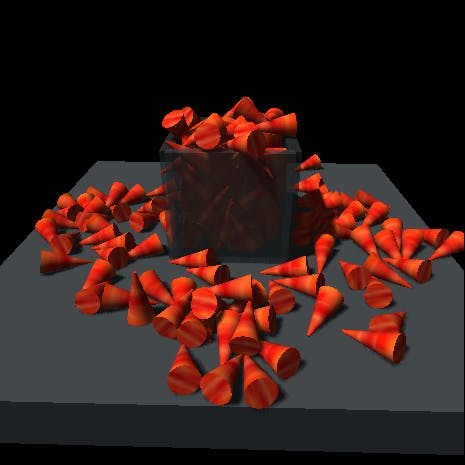

|Library                                                      |[ammo.js](https://github.com/kripken/ammo.js/)                                          |[Cannon.js](https://github.com/schteppe/cannon.js) /   [cannon-es](https://github.com/pmndrs/cannon-es)                                                                          |[Havok](https://doc.babylonjs.com/features/featuresDeepDive/physics)                          |[Oimo.js](https://github.com/lo-th/Oimo.js/) /   [OimoPhysics](https://github.com/saharan/OimoPhysics)                                                                             |[rapier](https://github.com/dimforge/rapier)                                              |WGSL                                                                                 |
|:------------------------------------------------------------|:---------------------------------------------------------------------------------------|:-----------------------------------------------------------------------------------------------------------------------------------------------------------------------------------|:---------------------------------------------------------------------------------------------|:--------------------------------------------------------------------------------------------------------------------------------------------------------------------------------------|:-----------------------------------------------------------------------------------------|:------------------------------------------------------------------------------------|
|WebGL 1.0                                                    |                                                                                        |                                                                                                                                                                                    |[Link](https://cx20.github.io/webgl-physics-examples/examples/webgl1/havok/cone/)           |[Link](https://cx20.github.io/webgl-physics-examples/examples/webgl1/oimo/cone/)                                                                                                      |                                                                                          |                                                                                     |
|WebGL 2.0                                                    |                                                                                        |                                                                                                                                                                                    |[Link](https://cx20.github.io/webgl-physics-examples/examples/webgl2/havok/cone/)           |[Link](https://cx20.github.io/webgl-physics-examples/examples/webgl2/oimo/cone/)                                                                                                      |                                                                                          |                                                                                     |
|WebGPU                                                       |                                                                                        |                                                                                                                                                                                    |[Link](https://cx20.github.io/webgl-physics-examples/examples/webgpu/havok/cone/)           |[Link](https://cx20.github.io/webgl-physics-examples/examples/webgpu/oimo/cone/)                                                                                                      |                                                                                          |[Link](https://cx20.github.io/webgl-physics-examples/examples/webgpu/wgsl_compute/cone/) (WIP) |
|[Babylon.js](https://github.com/BabylonJS/Babylon.js)        |                                                                                        |                                                                                                                                                                                    |[Link](https://cx20.github.io/webgl-physics-examples/examples/babylonjs/havok/cone/)        |                                                                                                                                                                                       |                                                                                          |[Link](https://cx20.github.io/webgl-physics-examples/examples/babylonjs/wgsl_compute/cone/) (WIP)|
|[Babylon.js Lite](https://github.com/BabylonJS/Babylon.js)  |                                                                                        |                                                                                                                                                                                    |[Link](https://cx20.github.io/webgl-physics-examples/examples/babylonjs-lite/havok/cone/)   |                                                                                                                                                                                       |                                                                                          |                                                                                     |
|[Filament](https://github.com/google/filament)               |                                                                                        |                                                                                                                                                                                    |[Link](https://cx20.github.io/webgl-physics-examples/examples/filament/havok/cone/)           |                                                                                                                                                                                       |                                                                                          |                                                                                     |
|[PlayCanvas](https://github.com/playcanvas/engine)           |[Link](https://cx20.github.io/webgl-physics-examples/examples/playcanvas/ammo/cone/)    |                                                                                                                                                                                    |[Link](https://cx20.github.io/webgl-physics-examples/examples/playcanvas/havok/cone/)         |                                                                                                                                                                                       |                                                                                          |                                                                                     |
|[Rhodonite](https://github.com/actnwit/RhodoniteTS)          |                                                                                        |                                                                                                                                                                                    |[Link](https://cx20.github.io/webgl-physics-examples/examples/rhodonite/havok/cone/)         |                                                                                                                                                                                       |                                                                                          |                                                                                     |
|[three.js](https://github.com/mrdoob/three.js/)              |                                                                                        |                                                                                                                                                                                    |[Link](https://cx20.github.io/webgl-physics-examples/examples/threejs/havok/cone/)        |[Link1](https://cx20.github.io/webgl-physics-examples/examples/threejs/oimo/cone/) / [Link2](https://cx20.github.io/webgl-physics-examples/examples/threejs/oimophysics/cone/)        |[Link](https://cx20.github.io/webgl-physics-examples/examples/threejs/rapier/cone/)       |[Link](https://cx20.github.io/webgl-physics-examples/examples/threejs/wgsl_compute/cone/) (WIP)|

## Falling Eraser examples

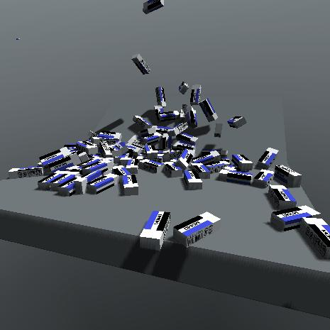

The WGSL versions run a from-scratch oriented-bounding-box (OBB) solver in a compute shader, using the Separating Axis Theorem for eraser-eraser and eraser-static contacts.

|Library                                                      |[ammo.js](https://github.com/kripken/ammo.js/)                                          |[Cannon.js](https://github.com/schteppe/cannon.js) /  [cannon-es](https://github.com/pmndrs/cannon-es)                                                                           |[Havok](https://doc.babylonjs.com/features/featuresDeepDive/physics)                          |[Oimo.js](https://github.com/lo-th/Oimo.js/) /   [OimoPhysics](https://github.com/saharan/OimoPhysics)                                                                              |[rapier](https://github.com/dimforge/rapier)                                              |WGSL                                                                                 |
|:------------------------------------------------------------|:---------------------------------------------------------------------------------------|:-----------------------------------------------------------------------------------------------------------------------------------------------------------------------------------|:---------------------------------------------------------------------------------------------|:--------------------------------------------------------------------------------------------------------------------------------------------------------------------------------------|:-----------------------------------------------------------------------------------------|:------------------------------------------------------------------------------------|
|WebGL 1.0                                                    |                                                                                        |                                                                                                                                                                                    |[Link](https://cx20.github.io/webgl-physics-examples/examples/webgl1/havok/eraser/)         |[Link](https://cx20.github.io/webgl-physics-examples/examples/webgl1/oimo/eraser/)                                                                                                    |                                                                                          |                                                                                     |
|WebGL 2.0                                                    |                                                                                        |                                                                                                                                                                                    |[Link](https://cx20.github.io/webgl-physics-examples/examples/webgl2/havok/eraser/)         |                                                                                                                                                                                      |                                                                                          |                                                                                     |
|WebGPU                                                       |                                                                                        |                                                                                                                                                                                    |[Link](https://cx20.github.io/webgl-physics-examples/examples/webgpu/havok/eraser/) [Link (physics debug)](https://cx20.github.io/webgl-physics-examples/examples/webgpu/havok/eraser_debug/)         |                                                                                                                                                                                      |                                                                                          |[Link](https://cx20.github.io/webgl-physics-examples/examples/webgpu/wgsl_compute/eraser/) [Link (physics debug)](https://cx20.github.io/webgl-physics-examples/examples/webgpu/wgsl_compute/eraser_debug/)|
|[Babylon.js](https://github.com/BabylonJS/Babylon.js)        |[Link](https://cx20.github.io/webgl-physics-examples/examples/babylonjs/ammo/eraser/)   |[Link](https://cx20.github.io/webgl-physics-examples/examples/babylonjs/cannon/eraser/)                                                                                             |[Link](https://cx20.github.io/webgl-physics-examples/examples/babylonjs/havok/eraser/)      |[Link](https://cx20.github.io/webgl-physics-examples/examples/babylonjs/oimo/eraser/)                                                                                                  |                                                                                          |[Link](https://cx20.github.io/webgl-physics-examples/examples/babylonjs/wgsl_compute/eraser/)|
|[Babylon.js Lite](https://github.com/BabylonJS/Babylon.js)  |                                                                                        |                                                                                                                                                                                    |[Link](https://cx20.github.io/webgl-physics-examples/examples/babylonjs-lite/havok/eraser/) |                                                                                                                                                                                       |                                                                                          |                                                                                     |
|[Filament](https://github.com/google/filament)               |                                                                                        |                                                                                                                                                                                    |[Link](https://cx20.github.io/webgl-physics-examples/examples/filament/havok/eraser/)         |                                                                                                                                                                                       |                                                                                          |                                                                                     |
|[GLBoost](https://github.com/emadurandal/GLBoost)            |                                                                                        |                                                                                                                                                                                    |                                                                                              |[Link](https://cx20.github.io/webgl-physics-examples/examples/glboost/oimo/eraser/)                                                                                                    |                                                                                          |                                                                                     |
|[Grimoire.js](https://github.com/GrimoireGL/GrimoireJS)      |                                                                                        |                                                                                                                                                                                    |                                                                                              |[Link](https://cx20.github.io/webgl-physics-examples/examples/grimoirejs/oimo/eraser/)                                                                                                 |                                                                                          |                                                                                     |
|[PlayCanvas](https://github.com/playcanvas/engine)           |[Link](https://cx20.github.io/webgl-physics-examples/examples/playcanvas/ammo/eraser/)  |                                                                                                                                                                                    |[Link](https://cx20.github.io/webgl-physics-examples/examples/playcanvas/havok/eraser/)       |                                                                                                                                                                                        |                                                                                          |                                                                                     |
|[three.js](https://github.com/mrdoob/three.js/)              |                                                                                        |                                                                                                                                                                                    |[Link](https://cx20.github.io/webgl-physics-examples/examples/threejs/havok/eraser/)|[Link](https://cx20.github.io/webgl-physics-examples/examples/threejs/oimo/eraser/)                                                                                                    |                                                                                          |[Link](https://cx20.github.io/webgl-physics-examples/examples/threejs/wgsl_compute/eraser/) (WIP)|
|[Rhodonite](https://github.com/actnwit/RhodoniteTS)          |                                                                                        |                                                                                                                                                                                    |[Link](https://cx20.github.io/webgl-physics-examples/examples/rhodonite/havok/eraser/)        |                                                                                                                                                                                        |                                                                                          |                                                                                     |

## Basic Shapes example (glTF Physics extension)

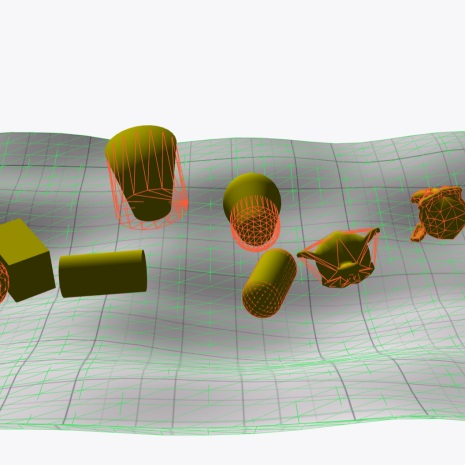

|Library                                                      |[ammo.js](https://github.com/kripken/ammo.js/)                                          |[Cannon.js](https://github.com/schteppe/cannon.js) /   [cannon-es](https://github.com/pmndrs/cannon-es)                                                                          |[Havok](https://doc.babylonjs.com/features/featuresDeepDive/physics)                          |[Oimo.js](https://github.com/lo-th/Oimo.js/)  /   [OimoPhysics](https://github.com/saharan/OimoPhysics)                                                                             |[rapier](https://github.com/dimforge/rapier)                                              |WGSL                                                                                                      |
|:------------------------------------------------------------|:---------------------------------------------------------------------------------------|:-----------------------------------------------------------------------------------------------------------------------------------------------------------------------------------|:---------------------------------------------------------------------------------------------|:--------------------------------------------------------------------------------------------------------------------------------------------------------------------------------------|:-----------------------------------------------------------------------------------------|:---------------------------------------------------------------------------------------------------------|
|WebGL 1.0                                                    |                                                                                        |                                                                                                                                                                                    |[Link](https://cx20.github.io/webgl-physics-examples/examples/webgl1/havok/gltf_physics_Basic_Shapes/) |                                                                                                                                                                                        |                                                                                          |                                                                                                          |
|WebGL 2.0                                                    |                                                                                        |                                                                                                                                                                                    |[Link](https://cx20.github.io/webgl-physics-examples/examples/webgl2/havok/gltf_physics_Basic_Shapes/) |                                                                                                                                                                                        |                                                                                          |                                                                                                          |
|WebGPU                                                       |                                                                                        |                                                                                                                                                                                    |[Link](https://cx20.github.io/webgl-physics-examples/examples/webgpu/havok/gltf_physics_Basic_Shapes/) |                                                                                                                                                                                        |                                                                                          |[Link](https://cx20.github.io/webgl-physics-examples/examples/webgpu/wgsl_compute/gltf_physics_Basic_Shapes/) (WIP)|
|[Babylon.js](https://github.com/BabylonJS/Babylon.js)        |                                                                                        |                                                                                                                                                                                    |[Link](https://cx20.github.io/webgl-physics-examples/examples/babylonjs/havok/gltf_physics_Basic_Shapes/) |                                                                                                                                                                                        |                                                                                          |[Link](https://cx20.github.io/webgl-physics-examples/examples/babylonjs/wgsl_compute/gltf_physics_Basic_Shapes/)|
|[Filament](https://github.com/google/filament)               |                                                                                        |                                                                                                                                                                                    |[Link](https://cx20.github.io/webgl-physics-examples/examples/filament/havok/gltf_physics_Basic_Shapes/)|                                                                                                                                                                                       |                                                                                          |                                                                                                          |
|[PlayCanvas](https://github.com/playcanvas/engine)           |[Link](https://cx20.github.io/webgl-physics-examples/examples/playcanvas/ammo/gltf_physics_Basic_Shapes/) |                                                                                                                                                                                    |                                                                                              |                                                                                                                                                                                        |                                                                                          |                                                                                                          |
|[Rhodonite](https://github.com/actnwit/RhodoniteTS)          |                                                                                        |                                                                                                                                                                                    |[Link](https://cx20.github.io/webgl-physics-examples/examples/rhodonite/havok/gltf_physics_Basic_Shapes/)|                                                                                                                                                                                        |                                                                                                         |                                                                                                          |
|[three.js](https://github.com/mrdoob/three.js/)              |                                                                                        |                                                                                                                                                                                    |[Link](https://cx20.github.io/webgl-physics-examples/examples/threejs/havok/gltf_physics_Basic_Shapes/) |                                                                                                                                                                                        |[Link](https://cx20.github.io/webgl-physics-examples/examples/threejs/rapier/gltf_physics_Basic_Shapes/) |                                                                                                          |

## Materials Friction example (glTF Physics extension)

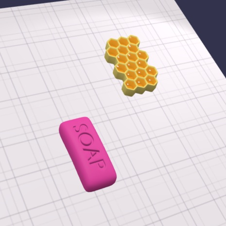

|Library                                                      |[ammo.js](https://github.com/kripken/ammo.js/)                                          |[Cannon.js](https://github.com/schteppe/cannon.js) /   [cannon-es](https://github.com/pmndrs/cannon-es)                                                                          |[Havok](https://doc.babylonjs.com/features/featuresDeepDive/physics)                          |[Oimo.js](https://github.com/lo-th/Oimo.js/)  /   [OimoPhysics](https://github.com/saharan/OimoPhysics)                                                                             |[rapier](https://github.com/dimforge/rapier)                                              |WGSL                                                                                                      |
|:------------------------------------------------------------|:---------------------------------------------------------------------------------------|:-----------------------------------------------------------------------------------------------------------------------------------------------------------------------------------|:---------------------------------------------------------------------------------------------|:--------------------------------------------------------------------------------------------------------------------------------------------------------------------------------------|:-----------------------------------------------------------------------------------------|:---------------------------------------------------------------------------------------------------------|
|WebGL 1.0                                                    |                                                                                        |                                                                                                                                                                                    |[Link](https://cx20.github.io/webgl-physics-examples/examples/webgl1/havok/gltf_physics_Materials_Friction/) |                                                                                                                                                                                        |                                                                                          |                                                                                                          |
|WebGL 2.0                                                    |                                                                                        |                                                                                                                                                                                    |[Link](https://cx20.github.io/webgl-physics-examples/examples/webgl2/havok/gltf_physics_Materials_Friction/) |                                                                                                                                                                                        |                                                                                          |                                                                                                          |
|WebGPU                                                       |                                                                                        |                                                                                                                                                                                    |[Link](https://cx20.github.io/webgl-physics-examples/examples/webgpu/havok/gltf_physics_Materials_Friction/) |                                                                                                                                                                                        |                                                                                          |[Link](https://cx20.github.io/webgl-physics-examples/examples/webgpu/wgsl_compute/gltf_physics_Materials_Friction/) |
|[Babylon.js](https://github.com/BabylonJS/Babylon.js)        |                                                                                        |                                                                                                                                                                                    |[Link](https://cx20.github.io/webgl-physics-examples/examples/babylonjs/havok/gltf_physics_Materials_Friction/) |                                                                                                                                                                                        |                                                                                          |                                                                                                          |
|[Babylon.js Lite](https://github.com/BabylonJS/Babylon.js)   |                                                                                        |                                                                                                                                                                                    |[Link](https://cx20.github.io/webgl-physics-examples/examples/babylonjs-lite/havok/gltf_physics_Materials_Friction/) |                                                                                                                                                                                        |                                                                                          |                                                                                                          |
|[Filament](https://github.com/google/filament)               |                                                                                        |                                                                                                                                                                                    |[Link](https://cx20.github.io/webgl-physics-examples/examples/filament/havok/gltf_physics_Materials_Friction/)|                                                                                                                                                                                       |                                                                                          |                                                                                                          |
|[PlayCanvas](https://github.com/playcanvas/engine)           |[Link](https://cx20.github.io/webgl-physics-examples/examples/playcanvas/ammo/gltf_physics_Materials_Friction/) |                                                                                                                                                                                    |                                                                                              |                                                                                                                                                                                        |                                                                                          |                                                                                                          |
|[Rhodonite](https://github.com/actnwit/RhodoniteTS)          |                                                                                        |                                                                                                                                                                                 |[Link](https://cx20.github.io/webgl-physics-examples/examples/rhodonite/havok/gltf_physics_Materials_Friction/)|                                                                                                                                                                                    |                                                                                                               |                                                                                                          |
|[three.js](https://github.com/mrdoob/three.js/)              |                                                                                        |[Link](https://cx20.github.io/webgl-physics-examples/examples/threejs/cannon-es/gltf_physics_Materials_Friction/) (WIP)                                                          |[Link](https://cx20.github.io/webgl-physics-examples/examples/threejs/havok/gltf_physics_Materials_Friction/) |[Link](https://cx20.github.io/webgl-physics-examples/examples/threejs/oimophysics/gltf_physics_Materials_Friction/)                                                                 |[Link](https://cx20.github.io/webgl-physics-examples/examples/threejs/rapier/gltf_physics_Materials_Friction/) |                                                                                                          |

## Materials Restitution example (glTF Physics extension)

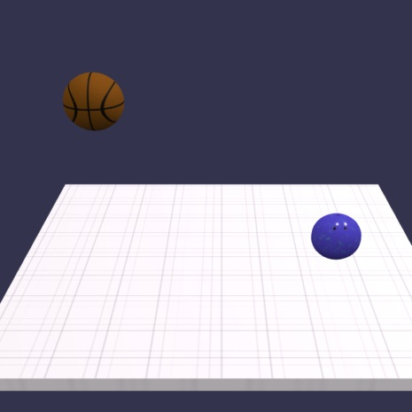

|Library                                                      |[ammo.js](https://github.com/kripken/ammo.js/)                                          |[Cannon.js](https://github.com/schteppe/cannon.js) /   [cannon-es](https://github.com/pmndrs/cannon-es)                                                                          |[Havok](https://doc.babylonjs.com/features/featuresDeepDive/physics)                          |[Oimo.js](https://github.com/lo-th/Oimo.js/)  /   [OimoPhysics](https://github.com/saharan/OimoPhysics)                                                                             |[rapier](https://github.com/dimforge/rapier)                                              |WGSL                                                                                                         |
|:------------------------------------------------------------|:---------------------------------------------------------------------------------------|:-----------------------------------------------------------------------------------------------------------------------------------------------------------------------------------|:---------------------------------------------------------------------------------------------|:--------------------------------------------------------------------------------------------------------------------------------------------------------------------------------------|:-----------------------------------------------------------------------------------------|:------------------------------------------------------------------------------------------------------------|
|WebGL 1.0                                                    |                                                                                        |                                                                                                                                                                                    |[Link](https://cx20.github.io/webgl-physics-examples/examples/webgl1/havok/gltf_physics_Materials_Restitution/) |                                                                                                                                                                                        |                                                                                          |                                                                                                             |
|WebGL 2.0                                                    |                                                                                        |                                                                                                                                                                                    |[Link](https://cx20.github.io/webgl-physics-examples/examples/webgl2/havok/gltf_physics_Materials_Restitution/) |                                                                                                                                                                                        |                                                                                          |                                                                                                             |
|WebGPU                                                       |                                                                                        |                                                                                                                                                                                    |[Link](https://cx20.github.io/webgl-physics-examples/examples/webgpu/havok/gltf_physics_Materials_Restitution/) |                                                                                                                                                                                        |                                                                                          |[Link](https://cx20.github.io/webgl-physics-examples/examples/webgpu/wgsl_compute/gltf_physics_Materials_Restitution/) |
|[Babylon.js](https://github.com/BabylonJS/Babylon.js)        |                                                                                        |                                                                                                                                                                                    |[Link](https://cx20.github.io/webgl-physics-examples/examples/babylonjs/havok/gltf_physics_Materials_Restitution/) |                                                                                                                                                                                        |                                                                                          |                                                                                                             |
|[Babylon.js Lite](https://github.com/BabylonJS/Babylon.js)   |                                                                                        |                                                                                                                                                                                    |[Link](https://cx20.github.io/webgl-physics-examples/examples/babylonjs-lite/havok/gltf_physics_Materials_Restitution/) |                                                                                                                                                                                        |                                                                                          |                                                                                                             |
|[Filament](https://github.com/google/filament)               |                                                                                        |                                                                                                                                                                                    |[Link](https://cx20.github.io/webgl-physics-examples/examples/filament/havok/gltf_physics_Materials_Restitution/)|                                                                                                                                                                                       |                                                                                          |                                                                                                          |
|[PlayCanvas](https://github.com/playcanvas/engine)           |[Link](https://cx20.github.io/webgl-physics-examples/examples/playcanvas/ammo/gltf_physics_Materials_Restitution/) |                                                                                                                                                                                    |                                                                                              |                                                                                                                                                                                        |                                                                                          |                                                                                                             |
|[Rhodonite](https://github.com/actnwit/RhodoniteTS)          |                                                                                        |                                                                                                                                                                                    |[Link](https://cx20.github.io/webgl-physics-examples/examples/rhodonite/havok/gltf_physics_Materials_Restitution/)|                                                                                                                                                                                        |                                                                                                                  |                                                                                                             |
|[three.js](https://github.com/mrdoob/three.js/)              |                                                                                        |                                                                                                                                                                                    |[Link](https://cx20.github.io/webgl-physics-examples/examples/threejs/havok/gltf_physics_Materials_Restitution/) |                                                                                                                                                                                        |[Link](https://cx20.github.io/webgl-physics-examples/examples/threejs/rapier/gltf_physics_Materials_Restitution/) |                                                                                                             |

## Motion Properties example (glTF Physics extension)

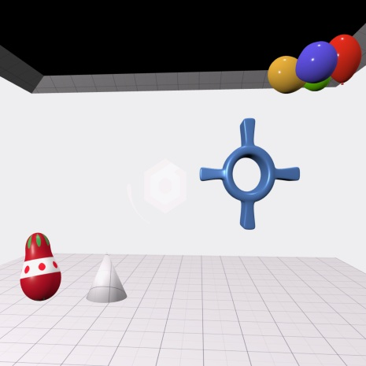

|Library                                                      |[ammo.js](https://github.com/kripken/ammo.js/)                                          |[Cannon.js](https://github.com/schteppe/cannon.js) /   [cannon-es](https://github.com/pmndrs/cannon-es)                                                                          |[Havok](https://doc.babylonjs.com/features/featuresDeepDive/physics)                          |[Oimo.js](https://github.com/lo-th/Oimo.js/)  /   [OimoPhysics](https://github.com/saharan/OimoPhysics)                                                                             |[rapier](https://github.com/dimforge/rapier)                                              |WGSL                                                                                                         |
|:------------------------------------------------------------|:---------------------------------------------------------------------------------------|:-----------------------------------------------------------------------------------------------------------------------------------------------------------------------------------|:---------------------------------------------------------------------------------------------|:--------------------------------------------------------------------------------------------------------------------------------------------------------------------------------------|:-----------------------------------------------------------------------------------------|:------------------------------------------------------------------------------------------------------------|
|WebGL 1.0                                                    |                                                                                        |                                                                                                                                                                                    |[Link](https://cx20.github.io/webgl-physics-examples/examples/webgl1/havok/gltf_physics_Motion_Properties/) (WIP)    |                                                                                                                                                                                        |                                                                                          |                                                                                                             |
|WebGL 2.0                                                    |                                                                                        |                                                                                                                                                                                    |[Link](https://cx20.github.io/webgl-physics-examples/examples/webgl2/havok/gltf_physics_Motion_Properties/) (WIP)    |                                                                                                                                                                                        |                                                                                          |                                                                                                             |
|WebGPU                                                       |                                                                                        |                                                                                                                                                                                    |[Link](https://cx20.github.io/webgl-physics-examples/examples/webgpu/havok/gltf_physics_Motion_Properties/) (WIP)    |                                                                                                                                                                                        |                                                                                          |[Link](https://cx20.github.io/webgl-physics-examples/examples/webgpu/wgsl_compute/gltf_physics_Motion_Properties/) (WIP)|
|[Babylon.js](https://github.com/BabylonJS/Babylon.js)        |                                                                                        |                                                                                                                                                                                    |[Link](https://cx20.github.io/webgl-physics-examples/examples/babylonjs/havok/gltf_physics_Motion_Properties/) (WIP) |                                                                                                                                                                                        |                                                                                          |                                                                                                             |
|[Filament](https://github.com/google/filament)               |                                                                                        |                                                                                                                                                                                    |[Link](https://cx20.github.io/webgl-physics-examples/examples/filament/havok/gltf_physics_Motion_Properties/)|                                                                                                                                                                                       |                                                                                          |                                                                                                          |
|[PlayCanvas](https://github.com/playcanvas/engine)           |[Link](https://cx20.github.io/webgl-physics-examples/examples/playcanvas/ammo/gltf_physics_Motion_Properties/) |                                                                                                                                                                                    |                                                                                              |                                                                                                                                                                                        |                                                                                          |                                                                                                             |
|[Rhodonite](https://github.com/actnwit/RhodoniteTS)          |                                                                                        |                                                                                                                                                                                    |[Link](https://cx20.github.io/webgl-physics-examples/examples/rhodonite/havok/gltf_physics_Motion_Properties/)|                                                                                                                                                                                        |                                                                                                         |                                                                                                          |
|[three.js](https://github.com/mrdoob/three.js/)              |                                                                                        |                                                                                                                                                                                    |[Link](https://cx20.github.io/webgl-physics-examples/examples/threejs/havok/gltf_physics_Motion_Properties/) |                                                                                                                                                                                        |[Link](https://cx20.github.io/webgl-physics-examples/examples/threejs/rapier/gltf_physics_Motion_Properties/) |                                                                                                             |

## Filtering example (glTF Physics extension)

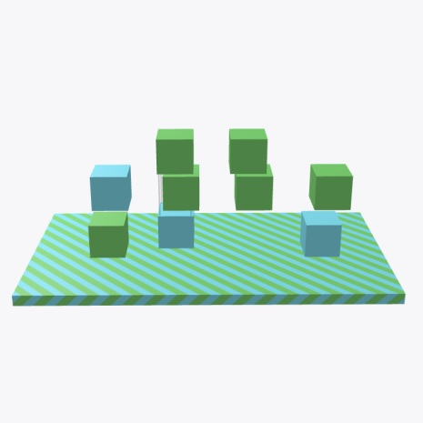

|Library                                                      |[ammo.js](https://github.com/kripken/ammo.js/)                                          |[Cannon.js](https://github.com/schteppe/cannon.js) /   [cannon-es](https://github.com/pmndrs/cannon-es)                                                                          |[Havok](https://doc.babylonjs.com/features/featuresDeepDive/physics)                          |[Oimo.js](https://github.com/lo-th/Oimo.js/)  /   [OimoPhysics](https://github.com/saharan/OimoPhysics)                                                                             |[rapier](https://github.com/dimforge/rapier)                                              |
|:------------------------------------------------------------|:---------------------------------------------------------------------------------------|:-----------------------------------------------------------------------------------------------------------------------------------------------------------------------------------|:---------------------------------------------------------------------------------------------|:--------------------------------------------------------------------------------------------------------------------------------------------------------------------------------------|:-----------------------------------------------------------------------------------------|
|WebGL 1.0                                                    |                                                                                        |                                                                                                                                                                                    |[Link](https://cx20.github.io/webgl-physics-examples/examples/webgl1/havok/gltf_physics_Filtering/) (WIP) |                                                                                                                                                                                       |                                                                                          |
|WebGL 2.0                                                    |                                                                                        |                                                                                                                                                                                    |[Link](https://cx20.github.io/webgl-physics-examples/examples/webgl2/havok/gltf_physics_Filtering/) (WIP) |                                                                                                                                                                                       |                                                                                          |
|WebGPU                                                       |                                                                                        |                                                                                                                                                                                    |[Link](https://cx20.github.io/webgl-physics-examples/examples/webgpu/havok/gltf_physics_Filtering/) (WIP) |                                                                                                                                                                                       |                                                                                          |
|[Babylon.js](https://github.com/BabylonJS/Babylon.js)        |                                                                                        |                                                                                                                                                                                    |[Link](https://cx20.github.io/webgl-physics-examples/examples/babylonjs/havok/gltf_physics_Filtering/) |                                                                                                                                                                                       |                                                                                          |
|[Filament](https://github.com/google/filament)               |                                                                                        |                                                                                                                                                                                    |[Link](https://cx20.github.io/webgl-physics-examples/examples/filament/havok/gltf_physics_Filtering/)|                                                                                                                                                                                       |                                                                                          |                                                                                                          |
|[PlayCanvas](https://github.com/playcanvas/engine)           |[Link](https://cx20.github.io/webgl-physics-examples/examples/playcanvas/ammo/gltf_physics_Filtering/) |                                                                                                                                                                                    |                                                                                              |                                                                                                                                                                                       |                                                                                          |
|[Rhodonite](https://github.com/actnwit/RhodoniteTS)          |                                                                                        |                                                                                                                                                                                    |[Link](https://cx20.github.io/webgl-physics-examples/examples/rhodonite/havok/gltf_physics_Filtering/) |                                                                                                                                                                                       |                                                                                          |
|[three.js](https://github.com/mrdoob/three.js/)              |                                                                                        |                                                                                                                                                                                    |[Link](https://cx20.github.io/webgl-physics-examples/examples/threejs/havok/gltf_physics_Filtering/) |                                                                                                                                                                                       |                                                                                          |

## Triggers example (glTF Physics extension)

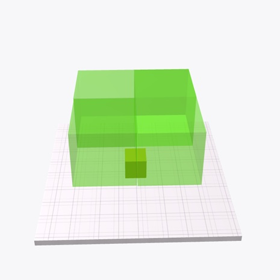

|Library                                                      |[ammo.js](https://github.com/kripken/ammo.js/)                                          |[Cannon.js](https://github.com/schteppe/cannon.js) /   [cannon-es](https://github.com/pmndrs/cannon-es)                                                                          |[Havok](https://doc.babylonjs.com/features/featuresDeepDive/physics)                          |[Oimo.js](https://github.com/lo-th/Oimo.js/)  /   [OimoPhysics](https://github.com/saharan/OimoPhysics)                                                                             |[rapier](https://github.com/dimforge/rapier)                                              |
|:------------------------------------------------------------|:---------------------------------------------------------------------------------------|:-----------------------------------------------------------------------------------------------------------------------------------------------------------------------------------|:---------------------------------------------------------------------------------------------|:--------------------------------------------------------------------------------------------------------------------------------------------------------------------------------------|:-----------------------------------------------------------------------------------------|
|WebGL 1.0                                                    |                                                                                        |                                                                                                                                                                                    |[Link](https://cx20.github.io/webgl-physics-examples/examples/webgl1/havok/gltf_physics_Triggers/) (WIP) |                                                                                                                                                                                       |                                                                                          |
|WebGL 2.0                                                    |                                                                                        |                                                                                                                                                                                    |[Link](https://cx20.github.io/webgl-physics-examples/examples/webgl2/havok/gltf_physics_Triggers/) (WIP) |                                                                                                                                                                                       |                                                                                          |
|WebGPU                                                       |                                                                                        |                                                                                                                                                                                    |[Link](https://cx20.github.io/webgl-physics-examples/examples/webgpu/havok/gltf_physics_Triggers/) (WIP) |                                                                                                                                                                                       |                                                                                          |
|[Babylon.js](https://github.com/BabylonJS/Babylon.js)        |                                                                                        |                                                                                                                                                                                    |[Link](https://cx20.github.io/webgl-physics-examples/examples/babylonjs/havok/gltf_physics_Triggers/) |                                                                                                                                                                                       |                                                                                          |
|[Filament](https://github.com/google/filament)               |                                                                                        |                                                                                                                                                                                    |[Link](https://cx20.github.io/webgl-physics-examples/examples/filament/havok/gltf_physics_Triggers/)|                                                                                                                                                                                       |                                                                                          |                                                                                                          |
|[PlayCanvas](https://github.com/playcanvas/engine)           |[Link](https://cx20.github.io/webgl-physics-examples/examples/playcanvas/ammo/gltf_physics_Triggers/) |                                                                                                                                                                                    |                                                                                              |                                                                                                                                                                                       |                                                                                          |
|[Rhodonite](https://github.com/actnwit/RhodoniteTS)          |                                                                                        |                                                                                                                                                                                    |[Link](https://cx20.github.io/webgl-physics-examples/examples/rhodonite/havok/gltf_physics_Triggers/) |                                                                                                                                                                                       |                                                                                          |
|[three.js](https://github.com/mrdoob/three.js/)              |                                                                                        |                                                                                                                                                                                    |[Link](https://cx20.github.io/webgl-physics-examples/examples/threejs/havok/gltf_physics_Triggers/) |                                                                                                                                                                                       |                                                                                          |

## JointTypes example (glTF Physics extension)

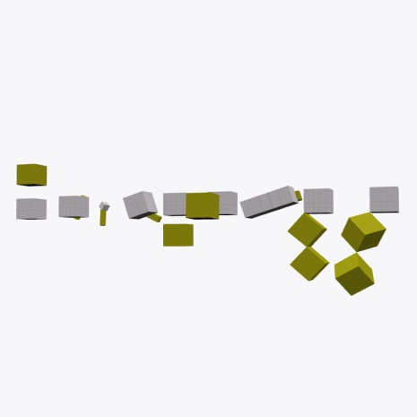

|Library                                                      |[ammo.js](https://github.com/kripken/ammo.js/)                                          |[Cannon.js](https://github.com/schteppe/cannon.js) /   [cannon-es](https://github.com/pmndrs/cannon-es)                                                                          |[Havok](https://doc.babylonjs.com/features/featuresDeepDive/physics)                          |[Oimo.js](https://github.com/lo-th/Oimo.js/)  /   [OimoPhysics](https://github.com/saharan/OimoPhysics)                                                                             |[rapier](https://github.com/dimforge/rapier)                                              |
|:------------------------------------------------------------|:---------------------------------------------------------------------------------------|:-----------------------------------------------------------------------------------------------------------------------------------------------------------------------------------|:---------------------------------------------------------------------------------------------|:--------------------------------------------------------------------------------------------------------------------------------------------------------------------------------------|:-----------------------------------------------------------------------------------------|
|WebGL 1.0                                                    |                                                                                        |                                                                                                                                                                                    |[Link](https://cx20.github.io/webgl-physics-examples/examples/webgl1/havok/gltf_physics_JointTypes/) (WIP) |                                                                                                                                                                                       |                                                                                          |
|WebGL 2.0                                                    |                                                                                        |                                                                                                                                                                                    |[Link](https://cx20.github.io/webgl-physics-examples/examples/webgl2/havok/gltf_physics_JointTypes/) (WIP) |                                                                                                                                                                                       |                                                                                          |
|WebGPU                                                       |                                                                                        |                                                                                                                                                                                    |[Link](https://cx20.github.io/webgl-physics-examples/examples/webgpu/havok/gltf_physics_JointTypes/) (WIP) |                                                                                                                                                                                       |                                                                                          |
|[Babylon.js](https://github.com/BabylonJS/Babylon.js)        |                                                                                        |                                                                                                                                                                                    |[Link](https://cx20.github.io/webgl-physics-examples/examples/babylonjs/havok/gltf_physics_JointTypes/) |                                                                                                                                                                                       |                                                                                          |
|[PlayCanvas](https://github.com/playcanvas/engine)           |[Link](https://cx20.github.io/webgl-physics-examples/examples/playcanvas/ammo/gltf_physics_JointTypes/) |                                                                                                                                                                                    |                                                                                              |                                                                                                                                                                                       |                                                                                          |
|[Rhodonite](https://github.com/actnwit/RhodoniteTS)          |                                                                                        |                                                                                                                                                                                    |[Link](https://cx20.github.io/webgl-physics-examples/examples/rhodonite/havok/gltf_physics_JointTypes/) |                                                                                                                                                                                       |                                                                                          |
|[three.js](https://github.com/mrdoob/three.js/)              |                                                                                        |                                                                                                                                                                                    |[Link](https://cx20.github.io/webgl-physics-examples/examples/threejs/havok/gltf_physics_JointTypes/) |                                                                                                                                                                                       |                                                                                          |

## glTF Physics Exporter example

Exports a Havok physics scene (floor + falling cube) as a `.glb` with [`KHR_physics_rigid_bodies`](https://github.com/eoineoineoin/glTF_Physics) and `KHR_implicit_shapes` extensions. The output round-trips through the loader used by the `gltf_physics_*` examples above.

|Library                                                      |[Havok](https://doc.babylonjs.com/features/featuresDeepDive/physics)                                          |
|:------------------------------------------------------------|:-------------------------------------------------------------------------------------------------------------|
|[Babylon.js](https://github.com/BabylonJS/Babylon.js)        |[Link](https://cx20.github.io/webgl-physics-examples/examples/babylonjs/havok/gltf_physics_Exporter/)         |

## Physics Library Unit Systems

All physics libraries used in this project adopt the **SI (International System of Units)**: meters (m), kilograms (kg), seconds (s), and newtons (N).  
The convention **1 unit = 1 meter** is recommended for stable simulation results.

| Library | Unit System | Recommended Scale | Notes |
|:--------|:------------|:------------------|:------|
| [ammo.js](https://github.com/kripken/ammo.js/) (Bullet) | SI (m / kg / s / N) | 0.05 – 10 m | Most sensitive to scale; official docs strongly recommend matching real-world meter scale |
| [Cannon.js](https://github.com/schteppe/cannon.js) / [cannon-es](https://github.com/pmndrs/cannon-es) | SI (m / kg / s / N) | Flexible | Relatively tolerant of scale variation |
| [Havok](https://doc.babylonjs.com/features/featuresDeepDive/physics) | SI (m / kg / s / N) | 0.1 – 10 m | |
| [Oimo.js](https://github.com/lo-th/Oimo.js/) / [OimoPhysics](https://github.com/saharan/OimoPhysics) | SI (m / kg / s / N) | 0.1 – 10 m | |
| [PhysX](https://github.com/fabmax/physx-js-webidl) | SI (m / kg / s / N) | 0.1 – 10 m | |
| [rapier](https://github.com/dimforge/rapier) | SI (m / kg / s / N) | Flexible | Good numerical stability across a wide range of scales |

> **Tip:** Objects smaller than ~0.05 m or larger than ~100 m may cause floating-point instability (jitter, tunneling). Keep rigid bodies within the recommended scale range for best results.
